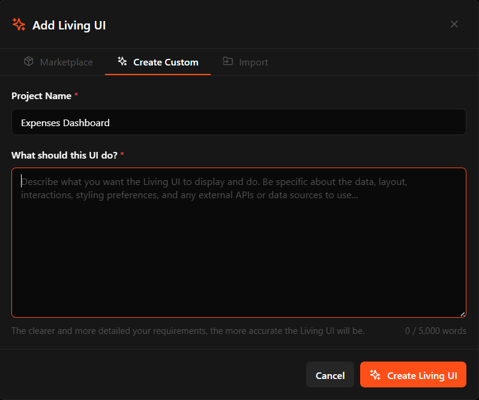
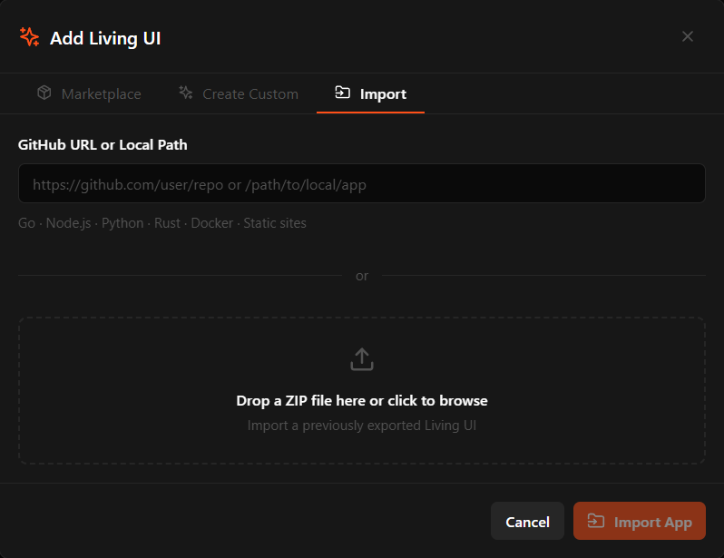

<div align="center">
    
</div>

Die meisten Agent-Frameworks hören bei Chat und Tool-Aufrufen auf. CraftBot geht weiter: Er baut, entwickelt und betreibt seine eigenen SaaS-Tools und nutzt diese Tool-Schicht dann, um mit dir zu kommunizieren und Aufgaben für dich zu automatisieren.

Darüber hinaus bringt CraftBot alle Kernfunktionen eines universellen Agent-Frameworks mit. Er erledigt Aufgaben wie ein:e Mitarbeitende:r aus der Ferne, merkt sich deine Vorlieben und Ziele und unterstützt dich proaktiv dabei, das zu planen und umzusetzen, was dir wichtig ist.

<p align="center">
  
  
  


  <a href="https://github.com/CraftOS-dev/CraftBot">
    
  </a>

  

  <a href="https://discord.gg/ZN9YHc37HG">
    
  </a>

  <a href="https://deepwiki.com/CraftOS-dev/CraftBot">
    
  </a>
</p>

<div align="center">
	
[](https://e2b.dev/startups)
</div>

<p align="center">
  <a href="README.md">English</a> | <a href="README.ja.md">日本語</a> | <a href="README.cn.md">简体中文</a> | <a href="README.zh-TW.md">繁體中文</a> | <a href="README.ko.md">한국어</a> | <a href="README.es.md">Español</a> | <a href="README.pt-BR.md">Português</a> | <a href="README.fr.md">Français</a>
</p>

## ✨ Wichtigste Funktionen

Über die Fähigkeit hinaus, eigene SaaS-Tools zu erstellen und zu betreiben, bringt CraftBot alle Kernfunktionen eines Agent-Frameworks mit. So kann er als universeller KI-Agent an deiner Seite über deine Aufgaben, Tools, dein Gedächtnis und deine täglichen Workflows hinweg arbeiten.

- **Agent-Profile** Mehr als 40 Agent-Profile (CEO-Agent, Finance-Agent, Marketing-Lead-Agent, DevOps-Engineer, Video-Producer-Agent oder 37 weitere) stehen bereit, um für dich zu arbeiten. Finde die gewünschten Rollen in den **[CraftBot Agent Bundles](https://github.com/CraftOS-dev/craftbot-agent-bundles)** und importiere sie mit einem Klick.
- **Playbook-Katalog** Du weißt nicht, wie du mit einem KI-Agenten automatisieren sollst? CraftBot bringt 120 sofort einsatzbereite Playbooks mit (in 19 Kategorien). Öffne den Playbook-Picker in der oberen Leiste, wähle ein Playbook aus, und es beginnt, die Aufgabe für dich auszuführen.
- **Agent App.** Baue, importiere oder entwickle eigene Apps, die innerhalb von CraftBot leben. Der Agent kennt den Zustand der UI jederzeit und kann ihre Daten direkt lesen, schreiben und damit arbeiten.
- **Multitasking und Session-Routing.** Tippst du noch von Hand `/new`? CraftBot weiß selbst, wann eine neue Session sinnvoll ist und wann eine bestehende Aufgabe wieder aufgenommen werden sollte, so bleiben Gespräch und Kontext einheitlich.
- **Self-hosted und BYOK.** Flexibles LLM-Provider-System mit Unterstützung für OpenAI, Google Gemini, Anthropic Claude, OpenRouter und mehr. Oder hoste mit Ollama dein eigenes Modell, ganz ohne Token-Verbrauch.
- **Memory-System.** Ein zweites Gehirn, aufgebaut aus deinen Interaktionen mit CraftBot. Hybrider Ansatz: RAG + Wissensgraph + Agent-Dateisystem. Um Mitternacht „träumt" CraftBot und konsolidiert die Ereignisse des Tages.
- **Proaktiver Agent.** Er lernt deine Vorlieben, Gewohnheiten und Lebensziele kennen, plant darauf basierend und stößt Aufgaben an (natürlich nur mit deiner Freigabe), um dich in deinem Leben weiterzubringen.
- **Integration externer Tools.** Verbinde deine Apps wie Google Workspace, Slack, Notion, Zoom, LinkedIn, Discord, Telegram und mehr (weitere folgen!) mit OAuth-Unterstützung oder deinem eigenen Schlüssel. Du kannst mit jeder Integration mehrere Konten verbinden.
- **Skills und MCP.** Über 150 MCPs und 170 Skills sofort einsatzbereit. Neue Skills und MCPs lassen sich schnell installieren, und aus abgeschlossenen Aufgaben kannst du mit einem Klick neue Skills erstellen oder verbessern.
- **Browser-Oberfläche und CLI.** Nutze CraftBot so, wie es zu dir passt: über eine einfache Browser-UI für die tägliche Arbeit oder per CLI für Skripte und Headless-Umgebungen.

---


## 🧰 Erste Schritte

Voraussetzungen: Python 3.10+ · Node.js 18+ für den Browser-Modus

```bash
# 1. Repository klonen
git clone https://github.com/CraftOS-dev/CraftBot.git
cd CraftBot

# 2. Installieren, Autostart einrichten und CraftBot starten
python craftbot.py install
```

Mehr ist nicht nötig. Das Terminal schließt sich von selbst, CraftBot läuft im Hintergrund weiter und der Browser öffnet sich automatisch. Zusätzlich wird eine **Desktop-Verknüpfung** angelegt, mit der du den Browser jederzeit wieder öffnen kannst.

**Den Dienst nach der Installation verwalten:**

```bash
python craftbot.py start      # CraftBot im Hintergrund starten
python craftbot.py stop       # CraftBot stoppen
python craftbot.py restart    # CraftBot neu starten
python craftbot.py status     # Prüfen, ob CraftBot läuft und ob Autostart aktiv ist
python craftbot.py logs       # Letzte Log-Ausgaben anzeigen
python craftbot.py uninstall  # Stoppen, Autostart entfernen und Pakete deinstallieren
```

> [!TIP]
> Nach `install` oder `start` wird automatisch eine **CraftBot-Desktop-Verknüpfung** erstellt. Wenn du den Browser geschlossen hast, öffnest du ihn per Doppelklick auf die Verknüpfung erneut.

---

## 🌱 Agent App

**Agent App ist ein System/App/Dashboard, das mit deinen Anforderungen wächst.**

<div align="center">
    
</div>

- Brauchst du ein Kanban-Board mit eingebautem KI-Copiloten? 
- Ein maßgeschneidertes CRM, das exakt deinem Workflow folgt? 
- Ein Unternehmens-Dashboard, das CraftBot lesen und für dich bedienen kann? 

Bring es als Agent App an den Start: Es läuft neben CraftBot und wächst mit deinen Anforderungen.

### Drei Wege, eine Agent App zu erstellen

1. **Von Grund auf bauen.** Beschreibe in natürlicher Sprache, was du brauchst. CraftBot
   erstellt das Gerüst für Datenmodell, Backend-API und React-UI und iteriert mit dir
   über einen strukturierten Designprozess.

<div align="center">
    
</div>

2. **Aus dem Marketplace installieren.** Stöbere in von der Community gebauten Agent Apps auf [living-ui-marketplace](https://github.com/CraftOS-dev/living-ui-marketplace).

<div align="center">
    
</div>

3. **Ein bestehendes Projekt importieren.** Verweise CraftBot auf ein Projekt in Go, Node.js, Python,
   Rust oder auf statischen Quellcode bzw. ein GitHub-Repo. Er erkennt die Runtime, konfiguriert die Health Checks und verpackt das Ganze als Agent App.

<div align="center">
    
</div>

### Entwickelt sich weiter, mit CraftBot mittendrin

Eine Agent App ist nie „fertig". Bitte den Agent, Funktionen zu ergänzen,
eine Ansicht neu zu gestalten oder sie an neue Daten anzubinden, wenn sich deine Anforderungen ändern.

CraftBot ist in jede Agent App eingebettet und **kennt deren Zustand**:
Er kann das aktuelle DOM und Formularwerte lesen, App-Daten über die REST-API
abfragen und in deinem Namen Aktionen auslösen.

### Hält SaaS-Tools offen und lebendig

Baue, passe an und entwickle deine eigene Agent App weiter und reduziere deine Abhängigkeit von Abo-Tools, die nie wirklich für dich gemacht waren.

---
 
# Drei Agent Apps, die du in 5 Minuten ausprobieren kannst
 
- **📋 Kanban-Board:** Alle Aufgaben, Follow-ups und CTAs an einem Ort. CraftBot kann es bedienen und die PM-Arbeit für dich übernehmen.
- **📊 Habit Tracker:** Baue deine Gewohnheiten auf und verfolge sie. Ein Aktivitätskalender im GitHub-Stil hilft dir, deine Gewohnheiten wie ein:e Entwickler:in zu pflegen.
- **🐦 Luolinglo:** Kein Duolingo, aber damit kannst du neue Sprachen lernen, Karteikarten erstellen und mit CraftBot üben.

**[Stöbere im Agent-App-Marketplace und trage etwas bei →](https://craftos.net/marketplace)**

---

## 🔧 Fehlerbehebung & häufige Probleme

### Node.js fehlt (für den Browser-Modus)
Wenn du beim Ausführen von `python run.py` **„npm not found in PATH"** siehst:
1. Lade die LTS-Version von [nodejs.org](https://nodejs.org/) herunter
2. Installiere sie und starte dein Terminal neu
3. Führe `python run.py` erneut aus

**Alternative:** CLI-Modus verwenden (kein Node.js nötig):
```bash
python run.py --cli
```

### Installation schlägt bei Abhängigkeiten fehl
Das Installationsprogramm liefert jetzt detaillierte Fehlermeldungen mit Lösungen. Wenn die Installation fehlschlägt:
- **Python-Version prüfen:** Stelle sicher, dass du Python 3.10+ hast (`python --version`)
- **Internetverbindung prüfen:** Während der Installation werden Abhängigkeiten heruntergeladen
- **Pip-Cache leeren:** `pip install --upgrade pip` ausführen und es erneut versuchen

### Probleme bei der Playwright-Installation
Die Installation von Chromium für Playwright ist optional. Falls sie fehlschlägt:
- Der Agent **funktioniert trotzdem** für andere Aufgaben
- Du kannst diesen Schritt überspringen und später `playwright install chromium` ausführen
- Erforderlich ist Chromium nur für die WhatsApp-Web-Integration

Eine ausführliche Fehlerbehebung findest du in [INSTALLATION_FIX.md](INSTALLATION_FIX.md).

---
## 🐳 Mit Container ausführen

Im Repository-Root liegt eine Docker-Konfiguration mit Python 3.10, wichtigen System-Paketen (inklusive Tesseract für OCR) und allen Python-Abhängigkeiten aus `environment.yml`/`requirements.txt`, damit der Agent auch in isolierten Umgebungen konsistent läuft. 

Hier sind die Schritte, um unseren Agent im Container zu starten.

### Image bauen

Im Repository-Root:

```bash
docker build -t craftbot .
```

### Container starten

Das Image ist so konfiguriert, dass der Agent standardmäßig mit `python -m app.main` startet. So führst du es interaktiv aus:

```bash
docker run --rm -it craftbot
```

Wenn du Umgebungsvariablen übergeben musst, nutze eine env-Datei (zum Beispiel basierend auf `.env.example`):

```bash
docker run --rm -it --env-file .env craftbot
```

Mounte mit `-v` Verzeichnisse, die außerhalb des Containers persistieren sollen (etwa Daten- oder Cache-Ordner), und passe Ports und weitere Flags an deine Deployment-Anforderungen an. Das Image bringt die System-Abhängigkeiten für OCR (`tesseract`) sowie gängige HTTP-Clients mit, damit der Agent im Container direkt mit Dateien und Netzwerk-APIs arbeiten kann.

Standardmäßig nutzt das Image Python 3.10 und bündelt die Python-Abhängigkeiten aus `environment.yml`/`requirements.txt`, daher funktioniert `python -m app.main` sofort.

---

## 🤝 Wie du beitragen kannst

PRs sind willkommen! Den Ablauf (Fork → Branch von `dev` → PR) findest du in [CONTRIBUTING.md](CONTRIBUTING.md). Alle Pull Requests durchlaufen automatisch eine Lint- und Smoke-Test-CI. 

> [!IMPORTANT]
> **CraftBot** wird aktiv entwickelt, mit Verbesserungen Woche für Woche. Für Fragen oder einen schnelleren Austausch komm zu uns auf [Discord](https://discord.gg/ZN9YHc37HG) oder schreib eine Mail an thamyikfoong(at)craftos.net.

---

## 🧾 Lizenz

Dieses Projekt steht unter der [MIT-Lizenz](LICENSE). Du darfst es frei nutzen, hosten und monetarisieren (bei Weiterverbreitung und Monetarisierung musst du dieses Projekt nennen).

---

## ⭐ Danksagung

Entwickelt und gepflegt von [CraftOS](https://craftos.net/) und Mitwirkenden.  
Wenn dir **CraftBot** weiterhilft, gib dem Repository bitte einen ⭐ und teile es mit anderen!

---

## Star-Verlauf

<a href="https://star-history.dera.page/#CraftOS-dev/CraftBot&type=date&legend=top-left">
 <picture>
   <source media="(prefers-color-scheme: dark)" srcset="https://star-history.dera.page/svg?repos=CraftOS-dev/CraftBot&type=date&theme=dark&legend=top-left" />
   <source media="(prefers-color-scheme: light)" srcset="https://star-history.dera.page/svg?repos=CraftOS-dev/CraftBot&type=date&legend=top-left" />
   
 </picture>
</a>
