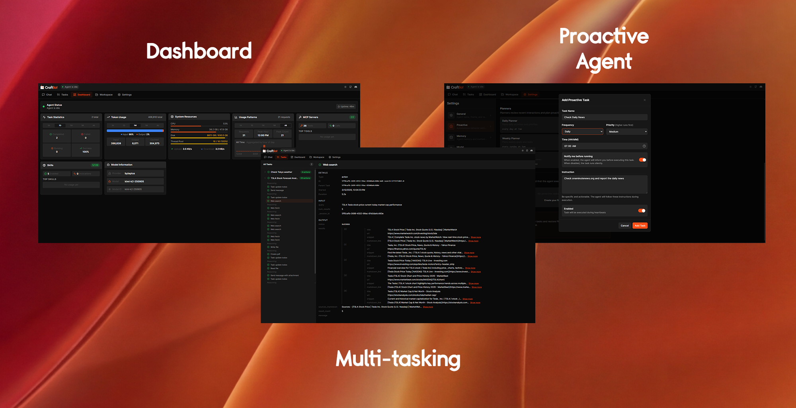
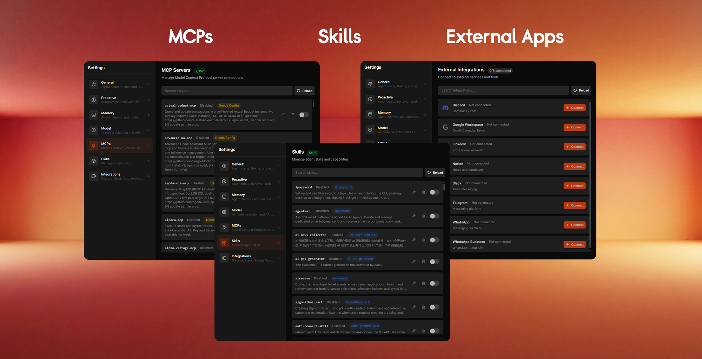

<div align="center">
    
</div>

<div align="center">
    
</div>

Die meisten Agent-Frameworks hören bei Chat und Tool-Aufrufen auf. CraftBot geht weiter: Er baut, entwickelt und betreibt seine eigenen SaaS-Tools und nutzt diese Tool-Schicht dann, um mit dir zu kommunizieren und Aufgaben für dich zu automatisieren.

Darüber hinaus bringt CraftBot alle Kernfunktionen eines universellen Agent-Frameworks mit. Er erledigt Aufgaben wie ein:e Mitarbeitende:r aus der Ferne, merkt sich deine Vorlieben und Ziele und unterstützt dich proaktiv dabei, das zu planen und umzusetzen, was dir wichtig ist.

<p align="center">
  
  
  


  <a href="https://github.com/CraftOS-dev/CraftBot">
    
  </a>

  

  <a href="https://discord.gg/ZN9YHc37HG">
    
  </a>
</p>

<div align="center">
	
[](https://e2b.dev/startups)
</div>

<p align="center" style="display: inline-block">
<a href="https://www.producthunt.com/products/craftbot?embed=true&amp;utm_source=badge-top-post-badge&amp;utm_medium=badge&amp;utm_campaign=badge-craftbot" target="_blank" rel="noopener noreferrer" style="display: inline-block">
	
</a>
<a href="https://theresanaiforthat.com/ai/craftbot/?ref=featured&v=10277523" target="_blank" rel="nofollow"></a>
</p>

<p align="center">
  <a href="README.md">English</a> | <a href="README.ja.md">日本語</a> | <a href="README.cn.md">简体中文</a> | <a href="README.zh-TW.md">繁體中文</a> | <a href="README.ko.md">한국어</a> | <a href="README.es.md">Español</a> | <a href="README.pt-BR.md">Português</a> | <a href="README.fr.md">Français</a>
</p>

## ✨ Wichtigste Funktionen

Über die Fähigkeit hinaus, eigene SaaS-Tools zu erstellen und zu betreiben, bringt CraftBot alle Kernfunktionen eines Agent-Frameworks mit. So kann er als universeller KI-Agent an deiner Seite über deine Aufgaben, Tools, dein Gedächtnis und deine täglichen Workflows hinweg arbeiten.

- **Living UI.** Baue, importiere oder entwickle eigene Apps, die innerhalb von CraftBot leben. Der Agent kennt den Zustand der UI jederzeit und kann ihre Daten direkt lesen, schreiben und damit arbeiten.
- **Multitasking und Session-Routing.** Tippst du noch von Hand `/new`? CraftBot weiß selbst, wann eine neue Session sinnvoll ist und wann eine bestehende Aufgabe wieder aufgenommen werden sollte – Gespräch und Kontext bleiben dabei einheitlich.
- **Self-hosted und BYOK.** Flexibles LLM-Provider-System mit Unterstützung für OpenAI, Google Gemini, Anthropic Claude, OpenRouter und mehr. Oder hoste mit Ollama dein eigenes Modell – ganz ohne Token-Verbrauch.
- **Memory-System.** Eine lokale Wissensbasis, die aus deiner Interaktion mit CraftBot via RAG + Agent-Dateisystem + Distillation aufgebaut wird. Um Mitternacht „träumt" CraftBot und konsolidiert die Ereignisse des Tages.
- **Proaktiver Agent.** Er lernt deine Vorlieben, Gewohnheiten und Lebensziele kennen, plant darauf basierend und stößt Aufgaben an (natürlich nur mit deiner Freigabe), um dich in deinem Leben weiterzubringen.
- **Integration externer Tools.** Verbinde dich mit Google Workspace, Slack, Notion, Zoom, LinkedIn, Discord und Telegram (weitere folgen!), mit eingebetteten Zugangsdaten und OAuth-Unterstützung.
- **Skills und MCP.** Über 150 MCPs und 170 Skills sofort einsatzbereit. Neue Skills und MCPs lassen sich schnell installieren, und aus abgeschlossenen Aufgaben kannst du mit einem Klick neue Skills erstellen oder verbessern.
- **Plattformübergreifend.** Volle Unterstützung für Windows, macOS und Linux mit plattformspezifischen Code-Varianten und Docker-Containerisierung.
- **Browser-Oberfläche und CLI.** Nutze CraftBot so, wie es zu dir passt: über eine einfache Browser-UI für die tägliche Arbeit oder per CLI für Skripte und Headless-Umgebungen.

---

## ✨ Funktionen

- **Bring Your Own Key (BYOK)** — Flexibles LLM-Provider-System mit Unterstützung für OpenAI, Google Gemini, Anthropic Claude, BytePlus und lokale Ollama-Modelle. Wechsle Anbieter mühelos.
- **Speichersystem** — Destilliert und konsolidiert um Mitternacht die Ereignisse des Tages.
- **Proaktiver Agent** — Lernt deine Vorlieben, Gewohnheiten und Lebensziele kennen. Anschließend plant er und startet (selbstverständlich nach Freigabe) Aufgaben, die dir beim Fortschritt helfen.
- **Living UI** — Baue, importiere oder entwickle eigene Apps weiter, die in CraftBot leben. Der Agent behält den UI-Zustand stets im Blick und kann deren Daten direkt lesen, schreiben und verarbeiten.
- **Externe Tool-Integration** — Verbinde dich mit Google Workspace, Slack, Notion, Zoom, LinkedIn, Discord und Telegram (weitere folgen!) mit eingebetteten Zugangsdaten und OAuth-Unterstützung.
- **MCP** — Integration des Model Context Protocol, um die Fähigkeiten des Agents um externe Tools und Dienste zu erweitern.
- **Skills** — Erweiterbares Skill-Framework mit eingebauten Skills für Aufgabenplanung, Recherche, Code-Reviews, Git-Operationen und mehr.
- **Plattformübergreifend** — Vollständige Unterstützung für Windows, macOS und Linux mit plattformspezifischen Code-Varianten und Docker-Containerisierung.

> [!IMPORTANT]
> **Der GUI-Modus ist veraltet.** CraftBot unterstützt den GUI-Modus (Desktop-Automatisierung) nicht mehr. Bitte verwende stattdessen den Browser- oder CLI-Modus.

<div align="center">
    
	
</div>

---


## 🧰 Erste Schritte

Voraussetzungen: Python 3.10+ · Node.js 18+ für den Browser-Modus

```bash
# 1. Repository klonen
git clone https://github.com/CraftOS-dev/CraftBot.git
cd CraftBot

# 2. Installieren, Autostart einrichten und CraftBot starten
python craftbot.py install
```

Mehr ist nicht nötig. Das Terminal schließt sich von selbst, CraftBot läuft im Hintergrund weiter und der Browser öffnet sich automatisch. Zusätzlich wird eine **Desktop-Verknüpfung** angelegt, mit der du den Browser jederzeit wieder öffnen kannst.

**Den Dienst nach der Installation verwalten:**

```bash
python craftbot.py start      # CraftBot im Hintergrund starten
python craftbot.py stop       # CraftBot stoppen
python craftbot.py restart    # CraftBot neu starten
python craftbot.py status     # Prüfen, ob CraftBot läuft und ob Autostart aktiv ist
python craftbot.py logs       # Letzte Log-Ausgaben anzeigen
python craftbot.py uninstall  # Stoppen, Autostart entfernen und Pakete deinstallieren
```

> [!TIP]
> Nach `install` oder `start` wird automatisch eine **CraftBot-Desktop-Verknüpfung** erstellt. Wenn du den Browser geschlossen hast, öffnest du ihn per Doppelklick auf die Verknüpfung erneut.

---

## 🌱 Living UI

**Eine Living UI ist ein System / eine App / ein Dashboard, das mit deinen Anforderungen mitwächst.**

- Brauchst du ein Kanban-Board mit eingebautem KI-Copiloten?
- Ein maßgeschneidertes CRM, das exakt deinem Workflow folgt?
- Ein Unternehmens-Dashboard, das CraftBot lesen und für dich bedienen kann?

```bash
# 1. Repository klonen
git clone https://github.com/CraftOS-dev/CraftBot.git
cd CraftBot

# 2. In einer conda-Umgebung installieren
python install.py --conda

# 3. CraftBot ausführen
conda run -n craftbot python run.py

# Falls conda nicht im PATH ist (nur Windows):
&"$env:USERPROFILE\miniconda3\Scripts\conda.exe" run -n craftbot python run.py
```

> [!NOTE]
> Jedes Mal wenn du CraftBot starten möchtest, verwende `conda run -n craftbot python run.py`. Es gibt keinen Hintergrunddienst — du startest und stoppst ihn selbst.

---

### Option 3 — Manuelle Installation (pip)

**Wähle dies, wenn:** du volle Kontrolle über deine Python-Umgebung möchtest und CraftBot lieber selbst verwaltest, ohne automatischen Dienst oder Hintergrundprozess.

`install.py` (ohne Optionen) führt eine Standard-pip-Installation in der aktuell aktiven Python-Umgebung durch. Du startest und stoppst CraftBot manuell mit `run.py`.

```bash
# 1. Repository klonen
git clone https://github.com/CraftOS-dev/CraftBot.git
cd CraftBot

# 2. Abhängigkeiten in der aktiven Python-Umgebung installieren
python install.py

# 3. CraftBot starten
python run.py
```

Beim ersten Start wirst du durch die Einrichtung deiner API-Schlüssel und Einstellungen geführt.

> [!NOTE]
> Wenn Node.js nicht installiert ist, führt dich das Installationsprogramm Schritt für Schritt durch die Installation. Du kannst den Browser-Modus auch vollständig überspringen und den CLI-Modus verwenden — kein Node.js nötig: `python run.py --cli`

### Was kannst du direkt danach tun?
- Natürlich mit dem Agent sprechen
- Ihn komplexe, mehrstufige Aufgaben ausführen lassen
- `/help` eingeben, um verfügbare Befehle zu sehen
- Dich mit Google, Slack, Notion und mehr verbinden

### 🖥️ Schnittstellenmodi

<div align="center">
    
</div>

CraftBot unterstützt mehrere UI-Modi. Wähle nach deinen Vorlieben:

| Modus | Befehl | Voraussetzungen | Empfohlen für |
|------|---------|--------------|----------|
| **Browser** | `python run.py` | Node.js 18+ | Moderne Web-Oberfläche, am einfachsten |
| **CLI** | `python run.py --cli` | Keine | Kommandozeile, leichtgewichtig |

Der **Browser-Modus** ist Standard und wird empfohlen. Ohne Node.js gibt dir das Installationsprogramm eine Anleitung – alternativ kannst du den **CLI-Modus** nutzen.

---

## 🧬 Living UI

**Living UI ist ein System/App/Dashboard, das mit deinen Anforderungen wächst.**

Brauchst du ein Kanban-Board mit eingebautem KI-Copiloten? Ein individuelles CRM,
das exakt zu deinem Workflow passt? Ein Unternehmens-Dashboard, das CraftBot
lesen und für dich steuern kann? Bring es als Living UI an den Start — es läuft
neben CraftBot und wächst mit deinen Anforderungen.

<div align="center">
    
</div>

### Drei Wege, eine Living UI zu erstellen

1. **Von Grund auf bauen.** Beschreibe in natürlicher Sprache, was du brauchst. CraftBot
   gerüst das Datenmodell, die Backend-API und die React-UI und iteriert mit dir
   über einen strukturierten Designprozess.

<div align="center">
    
</div>

2. **Aus dem Marketplace installieren.** Stöbere in von der Community gebauten Living UIs auf [living-ui-marketplace](https://github.com/CraftOS-dev/living-ui-marketplace).

<div align="center">
    
</div>

3. **Ein bestehendes Projekt importieren.** Verweise CraftBot auf ein Projekt in Go, Node.js, Python,
   Rust oder auf statischen Quellcode bzw. ein GitHub-Repo. Er erkennt die Runtime, konfiguriert die Health Checks und verpackt das Ganze als Living UI.

<div align="center">
    
</div>

### Entwickelt sich weiter – mit CraftBot mittendrin

Eine Living UI ist nie „fertig". Bitte den Agent, Funktionen zu ergänzen,
eine Ansicht neu zu gestalten oder sie an neue Daten anzubinden, wenn sich deine Anforderungen ändern.

CraftBot ist in jede Living UI eingebettet und **kennt deren Zustand**:
Er kann das aktuelle DOM und Formularwerte lesen, App-Daten über die REST-API
abfragen und in deinem Namen Aktionen auslösen.

### Hält SaaS-Tools offen und lebendig

Baue, passe an und entwickle deine eigene Living UI weiter – und reduziere deine Abhängigkeit von Abo-Tools, die nie wirklich für dich gemacht waren.

Wir suchen aktiv nach Entwickler:innen, die ihre Living UIs zeigen und in den **[Living-UI-Marketplace](https://craftos.net/marketplace)** exportieren. PRs sind herzlich willkommen!

---
 
# Drei Living UIs, die du in 5 Minuten ausprobieren kannst
 
- **📋 Kanban-Board** — Alle Aufgaben, Follow-ups und CTAs an einem Ort. CraftBot kann es bedienen und die PM-Arbeit für dich übernehmen.
- **📊 Habit Tracker** — Baue deine Gewohnheiten auf und verfolge sie. Ein Aktivitätskalender im GitHub-Stil hilft dir, deine Gewohnheiten wie ein:e Entwickler:in zu pflegen.
- **🐦 Luolinglo** — Kein Duolingo, aber damit kannst du neue Sprachen lernen, Karteikarten erstellen und mit CraftBot üben.

## 🧩 Architekturüberblick

| Komponente | Beschreibung |
|-----------|-------------|
| **Agent Base** | Zentrale Orchestrierungsschicht, die den Task-Lifecycle verwaltet, zwischen Komponenten koordiniert und die Haupt-Agenten-Schleife steuert. |
| **LLM Interface** | Einheitliche Schnittstelle mit Unterstützung mehrerer LLM-Anbieter (OpenAI, Gemini, Anthropic, BytePlus, Ollama). |
| **Context Engine** | Erzeugt optimierte Prompts mit KV-Cache-Unterstützung. |
| **Action Manager** | Ruft Aktionen aus der Bibliothek ab und führt sie aus. Eigene Aktionen lassen sich leicht erweitern. |
| **Action Router** | Wählt intelligent die am besten passende Aktion auf Basis der Task-Anforderungen und löst Eingabeparameter bei Bedarf über das LLM auf. |
| **Event Stream** | Echtzeit-Event-Publishing-System für Fortschrittsverfolgung, UI-Updates und Ausführungs-Monitoring. |
| **Memory Manager** | RAG-basiertes semantisches Gedächtnis mit ChromaDB. Übernimmt Memory-Chunking, Embedding, Retrieval und inkrementelle Updates. |
| **State Manager** | Globales State-Management zur Verfolgung von Ausführungskontext, Gesprächshistorie und Laufzeitkonfiguration. |
| **Task Manager** | Verwaltet Task-Definitionen, ermöglicht einfache und komplexe Task-Modi, erstellt To-dos und verfolgt mehrstufige Workflows. |
| **Skill Manager** | Lädt einsteckbare Skills und injiziert sie in den Agent-Kontext. |
| **MCP Adapter** | Model Context Protocol Integration, die MCP-Tools in native Aktionen umwandelt. |

---
 
# CraftBot im Vergleich zu den Alternativen
 
|                                  | v0 / Lovable / Bolt | OpenClaw | Claude Code | **CraftBot**                            |
| -------------------------------- | ------------------- | -------------------- | -------------------- | --------------------------------------- |
| **Baut individuelle Apps**           | ✅ Einmal-Shot         | 🚫                   | ✅ (manuell)          | ✅ Im Dialog                       |
| **Agent bedient die App**       | 🚫                  | ⚠️ Per Tool-Aufruf      | 🚫                   | ✅ In jede Living UI eingebettet         |
| **Persistente Agent-Memory**      | 🚫                  | ✅            | ✅                   | ✅ RAG + Agent-Dateisystem + Distillation        |
| **Selbst hostbar**     | ⚠️ Teilweise         | ✅                   | 🚫 SaaS              | ✅ MIT, auf deiner Maschine                    |
| **Modell-unabhängig**     | ✅         | ✅                   | ⚠️ Teilweise              | ✅ Große Anbieter + OpenRouter                    |
 
---

## 🔧 Fehlerbehebung & häufige Probleme

### Node.js fehlt (für den Browser-Modus)
Wenn du beim Ausführen von `python run.py` **„npm not found in PATH"** siehst:
1. Lade die LTS-Version von [nodejs.org](https://nodejs.org/) herunter
2. Installiere sie und starte dein Terminal neu
3. Führe `python run.py` erneut aus

| Flag | Beschreibung |
|------|-------------|
| `--conda` | conda-Umgebung nutzen (optional) |

### run.py

| Flag | Beschreibung |
|------|-------------|
| (keines) | Im **Browser**-Modus ausführen (empfohlen, Node.js erforderlich) |
| `--cli` | Im **CLI**-Modus ausführen (leichtgewichtig) |

### craftbot.py

| Befehl | Beschreibung |
|---------|-------------|
| `install` | Abhängigkeiten installieren, Autostart registrieren und CraftBot starten |
| `start` | CraftBot im Hintergrund starten |
| `stop` | CraftBot stoppen |
| `restart` | Stoppen und neu starten |
| `status` | Laufstatus und Autostart-Status anzeigen |
| `logs [-n N]` | Die letzten N Log-Zeilen anzeigen (Standard: 50) |
| `uninstall` | Autostart-Registrierung entfernen |

**Installationsbeispiele:**
```bash
# Einfache pip-Installation (ohne conda)
python install.py

# Mit conda-Umgebung (empfohlen für conda-Nutzer)
python install.py --conda
```

**CraftBot ausführen:**

```powershell
# Browser-Modus (Standard, Node.js erforderlich)
python run.py

# CLI-Modus (leichtgewichtig)
python run.py --cli
```

**Linux/macOS (Bash):**
```bash
# Browser-Modus (Standard, Node.js erforderlich)
python run.py

# CLI-Modus (leichtgewichtig)
python run.py --cli

# Mit conda-Umgebung
conda run -n craftbot python run.py
```

### 🔧 Hintergrunddienst (empfohlen)

Betreibe CraftBot als Hintergrunddienst, sodass er auch nach dem Schließen des Terminals weiterläuft. Eine Desktop-Verknüpfung wird automatisch erstellt, damit du den Browser jederzeit wieder öffnen kannst.

```bash
# Abhängigkeiten installieren, Autostart bei Anmeldung registrieren und CraftBot starten
python craftbot.py install
```

Das war's. Das Terminal schließt sich von selbst, CraftBot läuft im Hintergrund und der Browser öffnet sich automatisch.

```bash
# Weitere Dienstbefehle:
python craftbot.py start    # CraftBot im Hintergrund starten
python craftbot.py status   # Prüfen, ob er läuft
python craftbot.py stop     # CraftBot stoppen
python craftbot.py restart  # CraftBot neu starten
python craftbot.py logs     # Aktuelle Log-Ausgabe ansehen
```

| Befehl | Beschreibung |
|---------|-------------|
| `python craftbot.py install` | Abhängigkeiten installieren, Autostart bei Anmeldung registrieren, CraftBot starten, Browser öffnen und Terminal automatisch schließen |
| `python craftbot.py start` | CraftBot im Hintergrund starten – startet automatisch neu, wenn er bereits läuft (Terminal schließt sich selbst) |
| `python craftbot.py stop` | CraftBot stoppen |
| `python craftbot.py restart` | CraftBot stoppen und starten |
| `python craftbot.py status` | Prüfen, ob CraftBot läuft und ob Autostart aktiviert ist |
| `python craftbot.py logs` | Aktuelle Log-Ausgabe anzeigen (`-n 100` für mehr Zeilen) |
| `python craftbot.py uninstall` | CraftBot stoppen, Autostart entfernen, pip-Pakete deinstallieren und pip-Cache leeren |

> [!TIP]
> Nach `craftbot.py start` oder `craftbot.py install` wird automatisch eine **CraftBot-Desktop-Verknüpfung** erstellt. Hast du den Browser versehentlich geschlossen, doppelklicke die Verknüpfung, um ihn wieder zu öffnen.

> [!NOTE]
> **Installation:** Das Installationsprogramm gibt nun klare Hinweise, falls Abhängigkeiten fehlen. Wird Node.js nicht gefunden, wirst du zur Installation aufgefordert oder kannst in den CLI-Modus wechseln. Die Installation erkennt die GPU-Verfügbarkeit automatisch und fällt bei Bedarf auf den CPU-Modus zurück.

> [!TIP]
> **Ersteinrichtung:** CraftBot führt dich durch einen Onboarding-Ablauf, um API-Schlüssel, den Agentennamen, MCPs und Skills zu konfigurieren.

> [!NOTE]
> **Playwright Chromium:** Optional für die WhatsApp-Web-Integration. Schlägt die Installation fehl, funktioniert der Agent weiterhin für andere Aufgaben. Manuell nachinstallieren mit: `playwright install chromium`

---

## 🔧 Fehlerbehebung und häufige Probleme

### Fehlendes Node.js (für den Browser-Modus)
Erscheint **"npm not found in PATH"** beim Ausführen von `python run.py`:
1. Von [nodejs.org](https://nodejs.org/) herunterladen (LTS-Version wählen)
2. Installieren und das Terminal neu starten
3. `python run.py` erneut ausführen

**Alternative:** CLI-Modus verwenden (kein Node.js nötig):
```bash
python run.py --cli
```

### Installation schlägt bei Abhängigkeiten fehl
Das Installationsprogramm liefert jetzt detaillierte Fehlermeldungen mit Lösungen. Wenn die Installation fehlschlägt:
- **Python-Version prüfen:** Stelle sicher, dass du Python 3.10+ hast (`python --version`)
- **Internetverbindung prüfen:** Während der Installation werden Abhängigkeiten heruntergeladen
- **Pip-Cache leeren:** `pip install --upgrade pip` ausführen und es erneut versuchen

### Probleme bei der Playwright-Installation
Die Installation von Chromium für Playwright ist optional. Falls sie fehlschlägt:
- Der Agent **funktioniert trotzdem** für andere Aufgaben
- Du kannst diesen Schritt überspringen und später `playwright install chromium` ausführen
- Erforderlich ist Chromium nur für die WhatsApp-Web-Integration

Eine ausführliche Fehlerbehebung findest du in [INSTALLATION_FIX.md](INSTALLATION_FIX.md).

---
## 🐳 Mit Container ausführen

Im Repository-Root liegt eine Docker-Konfiguration mit Python 3.10, wichtigen System-Paketen (inklusive Tesseract für OCR) und allen Python-Abhängigkeiten aus `environment.yml`/`requirements.txt`, damit der Agent auch in isolierten Umgebungen konsistent läuft.

Hier sind die Schritte, um unseren Agent im Container zu starten.

### Image bauen

Im Repository-Root:

```bash
docker build -t craftbot .
```

### Container starten

Das Image ist so konfiguriert, dass der Agent standardmäßig mit `python -m app.main` startet. So führst du es interaktiv aus:

```bash
docker run --rm -it craftbot
```

Wenn du Umgebungsvariablen übergeben musst, nutze eine env-Datei (zum Beispiel basierend auf `.env.example`):

```bash
docker run --rm -it --env-file .env craftbot
```

Mounte mit `-v` Verzeichnisse, die außerhalb des Containers persistieren sollen (etwa Daten- oder Cache-Ordner), und passe Ports und weitere Flags an deine Deployment-Anforderungen an. Das Image bringt die System-Abhängigkeiten für OCR (`tesseract`) sowie gängige HTTP-Clients mit, damit der Agent im Container direkt mit Dateien und Netzwerk-APIs arbeiten kann.

Standardmäßig nutzt das Image Python 3.10 und bündelt die Python-Abhängigkeiten aus `environment.yml`/`requirements.txt`, daher funktioniert `python -m app.main` sofort.

---

## 🤝 Wie du beitragen kannst

PRs sind willkommen! Den Ablauf (Fork → Branch von `dev` → PR) findest du in [CONTRIBUTING.md](CONTRIBUTING.md). Alle Pull Requests durchlaufen automatisch eine Lint- und Smoke-Test-CI.

> [!IMPORTANT]
> **CraftBot** wird aktiv entwickelt, mit Verbesserungen Woche für Woche. Für Fragen oder einen schnelleren Austausch komm zu uns auf [Discord](https://discord.gg/ZN9YHc37HG) oder schreib eine Mail an thamyikfoong(at)craftos.net.

---

## 🧾 Lizenz

Dieses Projekt steht unter der [MIT-Lizenz](LICENSE). Du darfst es frei nutzen, hosten und monetarisieren (bei Weiterverbreitung und Monetarisierung musst du dieses Projekt nennen).

---

## ⭐ Danksagung

Entwickelt und gepflegt von [CraftOS](https://craftos.net/) und Mitwirkenden.
Wenn dir **CraftBot** weiterhilft, gib dem Repository bitte einen ⭐ und teile es mit anderen!

---

## Star-Verlauf

<a href="https://www.star-history.com/?repos=CraftOS-dev%2FCraftBot&type=date&legend=top-left">
 <picture>
   <source media="(prefers-color-scheme: dark)" srcset="https://api.star-history.com/chart?repos=CraftOS-dev/CraftBot&type=date&theme=dark&legend=top-left" />
   <source media="(prefers-color-scheme: light)" srcset="https://api.star-history.com/chart?repos=CraftOS-dev/CraftBot&type=date&legend=top-left" />
   
 </picture>
</a>
