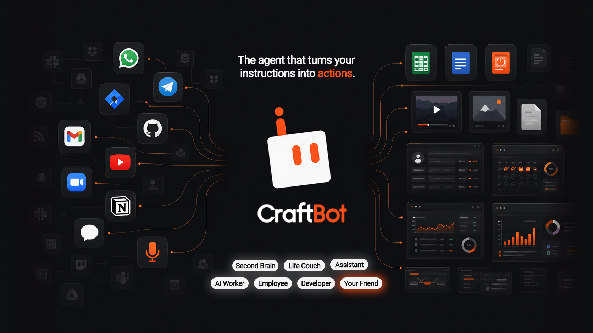
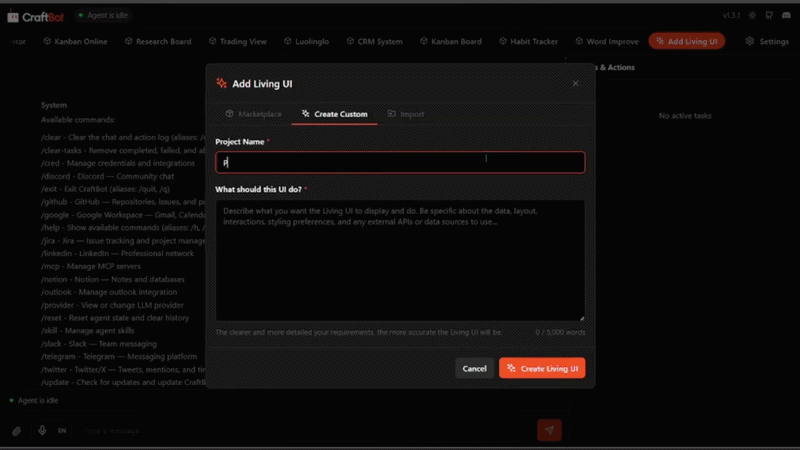

<div align="center">
    
</div>

La plupart des harnais d'agents s'arrêtent au chat et aux appels d'outils. CraftBot va plus loin : il construit, fait évoluer et opère ses propres outils SaaS, puis se sert de cette couche d'outils pour communiquer avec vous et automatiser vos tâches.

Au-delà de cela, CraftBot dispose de toutes les capacités essentielles d'un harnais d'agent généraliste. Il exécute des tâches comme le ferait un employé à distance, retient vos préférences et vos objectifs, et vous aide de manière proactive à planifier et à agir sur ce qui compte vraiment pour vous.

<p align="center">
  
  
  


  <a href="https://github.com/CraftOS-dev/CraftBot">
    
  </a>

  

  <a href="https://discord.gg/ZN9YHc37HG">
    
  </a>
</p>

<div align="center">
	
[](https://e2b.dev/startups)
</div>

<p align="center" style="display: inline-block">
<a href="https://www.producthunt.com/products/craftbot?embed=true&amp;utm_source=badge-top-post-badge&amp;utm_medium=badge&amp;utm_campaign=badge-craftbot" target="_blank" rel="noopener noreferrer" style="display: inline-block">
	
</a>
<a href="https://theresanaiforthat.com/ai/craftbot/?ref=featured&v=10277523" target="_blank" rel="nofollow"></a>
</p>

<p align="center">
  <a href="README.md">English</a> | <a href="README.ja.md">日本語</a> | <a href="README.cn.md">简体中文</a> | <a href="README.zh-TW.md">繁體中文</a> | <a href="README.ko.md">한국어</a> | <a href="README.es.md">Español</a> | <a href="README.pt-BR.md">Português</a> | <a href="README.de.md">Deutsch</a>
</p>

<div align="center">
    
</div>

## ✨ Fonctionnalités phares

En plus d'être un agent IA capable de créer et d'opérer ses propres outils SaaS, CraftBot embarque toutes les fonctionnalités de base d'un harnais d'agent, ce qui lui permet de fonctionner comme un agent IA généraliste qui vous accompagne au quotidien sur vos tâches, vos outils, votre mémoire et vos workflows.

- **Profils d'agent** Plus de 40 profils d'agent (agent CEO, agent finance, agent responsable marketing, ingénieur DevOps, agent producteur vidéo, et 37 autres) prêts à travailler pour vous. Trouvez les rôles souhaités dans **[CraftBot Agent Bundles](https://github.com/CraftOS-dev/craftbot-agent-bundles)** et importez-les en un clic.
- **Catalogue de playbooks** Vous ne savez pas comment automatiser avec un agent IA ? CraftBot propose 120 playbooks prêts à l'emploi (répartis sur 19 catégories). Ouvrez le sélecteur de playbooks depuis la barre supérieure, choisissez un playbook, et il commence à exécuter la tâche pour vous.
- **Living UI.** Construisez, importez ou faites évoluer des applications personnalisées qui vivent à l'intérieur de CraftBot. L'agent est en permanence au courant de l'état de l'UI et peut lire, écrire et agir directement sur ses données.
- **Multi-tâches et routage de sessions.** Vous tapez encore `/new` à la main ? CraftBot sait quand démarrer une nouvelle session et quand reprendre une tâche, en gardant la conversation et le contexte unifiés.
- **Auto-hébergé et BYOK.** Système de fournisseurs LLM flexible qui prend en charge OpenAI, Google Gemini, Anthropic Claude, OpenRouter et plus encore. Ou hébergez votre propre modèle, sans dépenser un seul token, avec Ollama.
- **Système de mémoire.** Une base de connaissance locale construite à partir de vos échanges avec CraftBot via RAG + système de fichiers de l'agent + distillation. À minuit, CraftBot « rêve » et consolide les événements survenus dans la journée.
- **Agent proactif.** Il apprend vos préférences, vos habitudes et vos objectifs de vie. Puis il planifie et déclenche des tâches (avec votre accord, bien sûr) pour vous aider à progresser.
- **Intégration d'outils externes.** Connectez vos applications comme Google Workspace, Slack, Notion, Zoom, LinkedIn, Discord, Telegram et bien plus (et bien d'autres à venir !) avec la prise en charge d'OAuth ou votre propre clé.
- **Skills et MCP.** Plus de 150 MCP et 170 Skills disponibles. Installation rapide de nouveaux Skills et MCP. Créez ou améliorez des Skills à partir de tâches terminées en un clic.
- **Interface web et CLI.** Utilisez CraftBot comme il vous convient le mieux : via une UI navigateur simple pour un usage quotidien, ou via la CLI pour le scripting et les environnements headless.

---


## 🧰 Pour commencer

### Prérequis
- Python **3.10+**
- `git` (nécessaire pour cloner le dépôt)
- Une clé API pour le fournisseur LLM de votre choix (OpenAI, Gemini ou Anthropic)
- `Node.js` **18+** (optionnel — requis uniquement pour l'interface navigateur)
- `conda` (optionnel — s'il est introuvable, l'installateur propose d'installer Miniconda automatiquement)

### Quelle option choisir ?

> **Vous hésitez ? Optez pour l'Option 1.** Elle gère tout pour vous.

| | Option 1 — Service | Option 2 — Conda | Option 3 — Manuel |
|---|---|---|---|
| **Pour qui** | La plupart des utilisateurs, débutants, tests | Utilisateurs Conda souhaitant des environnements isolés | Utilisateurs avancés, Python personnalisé, contrôle total |
| **Gère Python/l'environnement automatiquement ?** | ✅ Automatique | ✅ Automatique | ❌ Vous le gérez |
| **Tourne en arrière-plan ?** | ✅ Oui, en tant que service | ❌ Non | ❌ Non |
| **Comment démarrer** | `python craftbot.py install` | `python install.py --conda` | `python install.py` |

---

### ⭐ Option 1 — Installation en service (Recommandée)

**Choisissez cette option si :** vous voulez que CraftBot fonctionne directement — service en arrière-plan, démarrage automatique à la connexion, raccourci sur le bureau, aucune étape manuelle.

`craftbot.py` gère tout : environnement Python, dépendances, gestion du processus en arrière-plan et enregistrement du démarrage automatique.

```bash
# 1. Cloner le dépôt
git clone https://github.com/CraftOS-dev/CraftBot.git
cd CraftBot

# 2. Installer, enregistrer le démarrage automatique et lancer CraftBot
python craftbot.py install
```

C'est tout. Le terminal se ferme tout seul, CraftBot tourne en arrière-plan et le navigateur s'ouvre automatiquement. Un **raccourci de bureau** est également créé pour vous permettre de rouvrir le navigateur quand vous voulez.

**Gérer le service après l'installation :**

```bash
python craftbot.py start      # Démarre CraftBot en arrière-plan
python craftbot.py stop       # Arrête CraftBot
python craftbot.py restart    # Redémarre CraftBot
python craftbot.py status     # Vérifie s'il tourne et si le démarrage auto est activé
python craftbot.py logs       # Affiche la sortie récente des logs
python craftbot.py uninstall  # Arrête, supprime le démarrage auto et désinstalle les paquets
```

> [!TIP]
> Après `install` ou `start`, un **raccourci CraftBot sur le bureau** est créé automatiquement. Si vous fermez le navigateur, il suffit de double-cliquer sur le raccourci pour le rouvrir.

---

## 🌱 Living UI

**La Living UI est un système / une app / un tableau de bord qui évolue avec vos besoins.**

<div align="center">
    
</div>

- Besoin d'un tableau kanban avec un copilote IA intégré ?
- D'un CRM sur mesure, conçu exactement à la forme de votre workflow ?
- D'un tableau de bord d'entreprise que CraftBot puisse lire et piloter pour vous ?

```bash
# 1. Clonez le dépôt
git clone https://github.com/CraftOS-dev/CraftBot.git
cd CraftBot

# 2. Installez dans un environnement conda
python install.py --conda

# 3. Lancez CraftBot
conda run -n craftbot python run.py

# Si conda n'est pas dans le PATH (Windows uniquement) :
&"$env:USERPROFILE\miniconda3\Scripts\conda.exe" run -n craftbot python run.py
```

> [!NOTE]
> Chaque fois que vous voulez lancer CraftBot, utilisez `conda run -n craftbot python run.py`. Il n'y a pas de service en arrière-plan — vous le démarrez et l'arrêtez vous-même.

---

### Option 3 — Installation manuelle (pip)

**Choisissez cette option si :** vous souhaitez un contrôle total sur votre environnement Python et préférez gérer CraftBot vous-même, sans service automatique ni processus en arrière-plan.

`install.py` (sans options) effectue une installation pip standard dans l'environnement Python actif. Vous démarrez et arrêtez CraftBot manuellement avec `run.py`.

```bash
# 1. Clonez le dépôt
git clone https://github.com/CraftOS-dev/CraftBot.git
cd CraftBot

# 2. Installez les dépendances dans votre environnement Python actif
python install.py

# 3. Lancez CraftBot
python run.py
```

La première exécution vous guidera dans la configuration de vos clés API et préférences.

> [!NOTE]
> Si Node.js n'est pas installé, l'installateur fournira des instructions étape par étape. Vous pouvez aussi ignorer complètement le mode navigateur et utiliser le mode CLI — sans Node.js : `python run.py --cli`

### Que pouvez-vous faire tout de suite ?
- Discuter avec l'agent naturellement
- Lui demander d'exécuter des tâches complexes en plusieurs étapes
- Taper `/help` pour voir les commandes disponibles
- Vous connecter à Google, Slack, Notion et plus

### 🖥️ Modes d'interface

<div align="center">
    
</div>

CraftBot propose plusieurs modes d'UI. Choisissez selon vos préférences :

| Mode | Commande | Prérequis | Idéal pour |
|------|---------|--------------|----------|
| **Browser** | `python run.py` | Node.js 18+ | Interface web moderne, la plus simple à utiliser |
| **CLI** | `python run.py --cli` | Aucun | Ligne de commande, léger |

Le **mode navigateur** est le mode par défaut et recommandé. Si vous n'avez pas Node.js, l'installateur vous guidera pour l'installer, ou vous pouvez utiliser le **mode CLI**.

---

## 🧬 Living UI

**Living UI est un système/une application/un tableau de bord qui évolue avec vos besoins.**

Besoin d'un tableau kanban avec un copilote IA intégré ? D'un CRM sur mesure taillé
exactement pour votre flux de travail ? D'un tableau de bord d'entreprise que CraftBot
peut lire et piloter pour vous ? Lancez-le comme une Living UI — elle tourne aux côtés
de CraftBot et grandit au rythme de vos besoins.

<div align="center">
    
</div>

### Trois façons de créer une Living UI

1. **Construire de zéro.** Décrivez ce que vous voulez en langage naturel. CraftBot
   échafaude le modèle de données, l'API back-end et l'UI React, puis itère avec vous
   à travers un processus de conception structuré.

<div align="center">
    
</div>

2. **Installer depuis le marketplace.** Parcourez les Living UIs créées par la communauté sur [living-ui-marketplace](https://github.com/CraftOS-dev/living-ui-marketplace).

<div align="center">
    
</div>

3. **Importer un projet existant.** Pointez CraftBot vers un projet en Go, Node.js, Python,
   Rust, du code source statique ou un dépôt GitHub. Il détecte le runtime, configure les health checks et l'enveloppe dans une Living UI.

<div align="center">
    
</div>

### Continue d'évoluer avec CraftBot dans la boucle

Une Living UI n'est jamais « finie ». Demandez à l'agent d'ajouter des fonctionnalités,
de redessiner une vue ou de la brancher à de nouvelles données au fur et à mesure que vos besoins évoluent.

CraftBot est intégré à chaque Living UI et **conscient de son état** :
il peut lire le DOM courant et les valeurs des formulaires, interroger les données de l'app via
l'API REST et déclencher des actions en votre nom.

### Garde les outils SaaS ouverts et vivants

Construisez, personnalisez et faites évoluer votre propre Living UI, et dépendez moins des outils par abonnement qui n'ont jamais été pensés pour coller parfaitement à vos besoins.

Nous cherchons activement des développeurs qui souhaitent mettre en avant leurs Living UIs et les exporter vers le **[marketplace de Living UI](https://craftos.net/marketplace)**. Les PRs sont les bienvenus !

---
 
# Trois Living UIs à essayer en 5 minutes
 
- **📋 Tableau Kanban** — Toutes les tâches, suivis et CTA au même endroit. CraftBot peut s'en charger et faire le travail de PM pour vous.
- **📊 Habit Tracker** — Mettez en place et suivez vos habitudes. Un calendrier d'activité façon GitHub pour suivre vos habitudes comme on suit ses commits.
- **🐦 Luolinglo** — Ce n'est pas Duolingo, mais vous pouvez y apprendre de nouvelles langues, créer des flashcards et vous entraîner avec CraftBot.

## 🧩 Aperçu de l'architecture

| Composant | Description |
|-----------|-------------|
| **Agent Base** | Couche d'orchestration centrale qui gère le cycle de vie des tâches, coordonne les composants et pilote la boucle agentique principale. |
| **LLM Interface** | Interface unifiée prenant en charge plusieurs fournisseurs LLM (OpenAI, Gemini, Anthropic, BytePlus, Ollama). |
| **Context Engine** | Génère des prompts optimisés avec support du cache KV. |
| **Action Manager** | Récupère et exécute les actions depuis la bibliothèque. Les actions personnalisées sont faciles à étendre. |
| **Action Router** | Sélectionne intelligemment l'action la plus adaptée aux exigences de la tâche et résout les paramètres d'entrée via le LLM au besoin. |
| **Event Stream** | Système de publication d'événements en temps réel pour le suivi de la progression des tâches, les mises à jour d'UI et le monitoring d'exécution. |
| **Memory Manager** | Mémoire sémantique basée sur le RAG via ChromaDB. Gère le découpage, l'embedding, la récupération et les mises à jour incrémentales. |
| **State Manager** | Gestion globale de l'état pour suivre le contexte d'exécution de l'agent, l'historique de conversation et la configuration d'exécution. |
| **Task Manager** | Gère les définitions de tâches, permet des modes simples et complexes, crée des to-dos et suit les workflows multi-étapes. |
| **Skill Manager** | Charge et injecte des skills enfichables dans le contexte de l'agent. |
| **MCP Adapter** | Intégration Model Context Protocol qui convertit les outils MCP en actions natives. |

---

## 🔜 Roadmap

- [X] **Module de mémoire** — Terminé.
- [ ] **Intégration d'outils externes** — En cours d'ajout !
- [X] **Couche MCP** — Terminée.
- [X] **Couche Skills** — Terminée.
- [ ] **Comportement proactif** — En cours

---

## 📋 Référence des commandes

### install.py

| Flag | Description |
|------|-------------|
| `--conda` | Utiliser un environnement conda (optionnel) |

### run.py

| Flag | Description |
|------|-------------|
| (aucun) | Lancer en mode **Browser** (recommandé, nécessite Node.js) |
| `--cli` | Lancer en mode **CLI** (léger) |

### craftbot.py

| Commande | Description |
|---------|-------------|
| `install` | Installe les deps, enregistre le démarrage automatique et lance CraftBot |
| `start` | Démarre CraftBot en arrière-plan |
| `stop` | Arrête CraftBot |
| `restart` | Arrête puis redémarre |
| `status` | Affiche l'état d'exécution et celui du démarrage automatique |
| `logs [-n N]` | Affiche les N dernières lignes de log (par défaut : 50) |
| `uninstall` | Supprime l'enregistrement du démarrage automatique |

**Exemples d'installation :**
```bash
# Installation simple via pip (sans conda)
python install.py

# Avec environnement conda (recommandé pour les utilisateurs de conda)
python install.py --conda
```

**Exécuter CraftBot :**

```powershell
# Mode Browser (par défaut, nécessite Node.js)
python run.py

# Mode CLI (léger)
python run.py --cli

# Avec environnement conda
conda run -n craftbot python run.py

# Ou en utilisant le chemin complet si conda n'est pas dans le PATH
&"$env:USERPROFILE\miniconda3\Scripts\conda.exe" run -n craftbot python run.py
```

**Linux/macOS (Bash) :**
```bash
# Mode Browser (par défaut, nécessite Node.js)
python run.py

# Mode CLI (léger)
python run.py --cli

# Avec environnement conda
conda run -n craftbot python run.py
```

### 🔧 Service en arrière-plan (recommandé)

Exécutez CraftBot en tant que service en arrière-plan pour qu'il continue de fonctionner même après la fermeture du terminal. Un raccourci de bureau est créé automatiquement pour rouvrir le navigateur à tout moment.

```bash
# Installer les dépendances, enregistrer le démarrage automatique à la connexion et lancer CraftBot
python craftbot.py install
```

C'est tout. Le terminal se ferme tout seul, CraftBot tourne en arrière-plan et le navigateur s'ouvre automatiquement.

```bash
# Autres commandes du service :
python craftbot.py start    # Démarre CraftBot en arrière-plan
python craftbot.py status   # Vérifie s'il tourne
python craftbot.py stop     # Arrête CraftBot
python craftbot.py restart  # Redémarre CraftBot
python craftbot.py logs     # Affiche les logs récents
```

| Commande | Description |
|---------|-------------|
| `python craftbot.py install` | Installe les dépendances, enregistre le démarrage automatique à la connexion, lance CraftBot, ouvre le navigateur et ferme le terminal automatiquement |
| `python craftbot.py start` | Démarre CraftBot en arrière-plan — redémarre automatiquement s'il est déjà lancé (le terminal se ferme tout seul) |
| `python craftbot.py stop` | Arrête CraftBot |
| `python craftbot.py restart` | Arrête puis démarre CraftBot |
| `python craftbot.py status` | Vérifie si CraftBot tourne et si le démarrage automatique est activé |
| `python craftbot.py logs` | Affiche les logs récents (`-n 100` pour plus de lignes) |
| `python craftbot.py uninstall` | Arrête CraftBot, supprime le démarrage automatique, désinstalle les paquets pip et purge le cache pip |

> [!TIP]
> Après `craftbot.py start` ou `craftbot.py install`, un **raccourci CraftBot sur le bureau** est créé automatiquement. Si vous fermez le navigateur par accident, double-cliquez sur le raccourci pour le rouvrir.

> [!NOTE]
> **Installation :** L'installateur fournit maintenant des indications claires si des dépendances manquent. Si Node.js est introuvable, on vous proposera de l'installer ou de basculer en mode CLI. L'installation détecte automatiquement la disponibilité du GPU et bascule en mode CPU si nécessaire.

> [!TIP]
> **Première configuration :** CraftBot vous guidera dans une séquence d'onboarding pour configurer les clés API, le nom de l'agent, les MCP et les Skills.

> [!NOTE]
> **Playwright Chromium :** Optionnel pour l'intégration WhatsApp Web. Si l'installation échoue, l'agent fonctionnera toujours pour les autres tâches. Installez-le manuellement plus tard avec : `playwright install chromium`

---

## 🔧 Dépannage et problèmes courants

### Node.js manquant (pour le mode navigateur)
Si vous voyez **« npm not found in PATH »** en lançant `python run.py` :
1. Téléchargez la version LTS depuis [nodejs.org](https://nodejs.org/)
2. Installez-la et redémarrez votre terminal
3. Relancez `python run.py`

**Alternative :** Utilisez le mode CLI (Node.js non requis) :
```bash
python run.py --cli
```

### L'installation échoue à cause des dépendances
L'installateur affiche désormais des messages d'erreur détaillés avec des pistes de résolution. Si l'installation échoue :
- **Vérifiez votre version de Python :** assurez-vous d'avoir Python 3.10+ (`python --version`)
- **Vérifiez votre connexion internet :** les dépendances sont téléchargées pendant l'installation
- **Videz le cache de pip :** lancez `pip install --upgrade pip` et réessayez

### Problèmes d'installation de Playwright
L'installation de Chromium pour Playwright est optionnelle. Si elle échoue :
- L'agent **continue de fonctionner** pour les autres tâches
- Vous pouvez la sauter et l'installer plus tard via `playwright install chromium`
- Elle n'est nécessaire que pour l'intégration WhatsApp Web

Pour un dépannage plus approfondi, voir [INSTALLATION_FIX.md](INSTALLATION_FIX.md).

---
## 🐳 Lancer dans un conteneur

La racine du dépôt contient une configuration Docker avec Python 3.10, les paquets système essentiels (dont Tesseract pour l'OCR) et toutes les dépendances Python définies dans `environment.yml`/`requirements.txt`, afin que l'agent tourne de manière cohérente dans des environnements isolés.

Voici les étapes pour lancer notre agent dans un conteneur.

### Construire l'image

Depuis la racine du dépôt :

```bash
docker build -t craftbot .
```

### Lancer le conteneur

Par défaut, l'image lance l'agent avec `python -m app.main`. Pour le lancer de manière interactive :

```bash
docker run --rm -it craftbot
```

Si vous devez passer des variables d'environnement, utilisez un fichier env (par exemple basé sur `.env.example`) :

```bash
docker run --rm -it --env-file .env craftbot
```

Montez avec `-v` les répertoires qui doivent persister en dehors du conteneur (par exemple les dossiers de données ou de cache) et ajustez les ports ou les autres flags en fonction de votre déploiement. L'image embarque les dépendances système nécessaires à l'OCR (`tesseract`) et des clients HTTP courants, pour que l'agent puisse manipuler des fichiers et des APIs réseau directement dans le conteneur.

Par défaut, l'image utilise Python 3.10 et embarque les dépendances Python de `environment.yml`/`requirements.txt`, donc `python -m app.main` fonctionne directement.

---

## 🤝 Comment contribuer

Les PRs sont les bienvenus ! Le workflow (fork → branche depuis `dev` → PR) est détaillé dans [CONTRIBUTING.md](CONTRIBUTING.md). Toutes les pull requests passent automatiquement par une CI de lint + smoke test.

> [!IMPORTANT]
> **CraftBot** est en développement actif, avec des améliorations chaque semaine. Pour toute question ou un échange plus rapide, rejoignez-nous sur [Discord](https://discord.gg/ZN9YHc37HG) ou écrivez à thamyikfoong(at)craftos.net.

---

## 🧾 Licence

Ce projet est distribué sous [Licence MIT](LICENSE). Vous êtes libre de l'utiliser, de l'héberger et de le monétiser (en cas de distribution ou de monétisation, vous devez créditer ce projet).

---

## ⭐ Remerciements

Développé et maintenu par [CraftOS](https://craftos.net/) et ses contributeurs.
Si **CraftBot** vous est utile, mettez une ⭐ au dépôt et partagez-le autour de vous !

---

## Historique des stars

<a href="https://star-history.dera.page/#CraftOS-dev/CraftBot&type=date&legend=top-left">
 <picture>
   <source media="(prefers-color-scheme: dark)" srcset="https://star-history.dera.page/svg?repos=CraftOS-dev/CraftBot&type=date&theme=dark&legend=top-left" />
   <source media="(prefers-color-scheme: light)" srcset="https://star-history.dera.page/svg?repos=CraftOS-dev/CraftBot&type=date&legend=top-left" />
   
 </picture>
</a>
