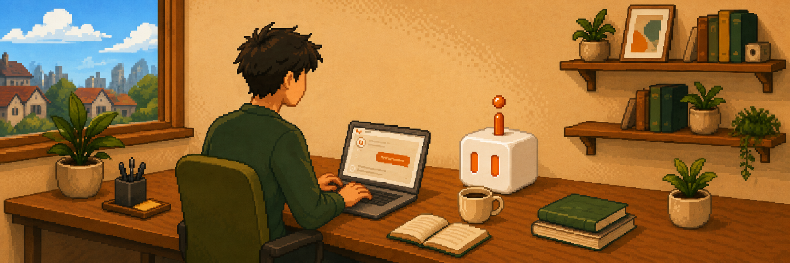

<div align="center">
    
</div>

대부분의 에이전트 하네스는 채팅과 도구 호출에서 멈춥니다. CraftBot은 거기서 한 발 더 나아갑니다. 자신만의 SaaS 도구를 직접 만들고, 진화시키고, 운영하며, 그 도구 계층을 통해 사용자와 소통하고 자동화를 수행합니다.

그 외에도 CraftBot은 범용 에이전트 하네스의 핵심 기능을 모두 갖추고 있습니다. 원격 직원처럼 작업을 수행하고, 사용자의 선호와 목표를 기억하며, 사용자에게 중요한 일을 주도적으로 계획하고 실행하도록 돕습니다.

<p align="center">
  
  
  


  <a href="https://github.com/CraftOS-dev/CraftBot">
    
  </a>

  

  <a href="https://discord.gg/ZN9YHc37HG">
    
  </a>

  <a href="https://deepwiki.com/CraftOS-dev/CraftBot">
    
  </a>
</p>

<div align="center">
	
[](https://e2b.dev/startups)
</div>

<p align="center">
  <a href="README.md">English</a> | <a href="README.ja.md">日本語</a> | <a href="README.cn.md">简体中文</a> | <a href="README.zh-TW.md">繁體中文</a> | <a href="README.es.md">Español</a> | <a href="README.pt-BR.md">Português</a> | <a href="README.fr.md">Français</a> | <a href="README.de.md">Deutsch</a>
</p>

## ✨ 주요 기능

자체 SaaS 도구를 만들고 운영할 수 있는 AI 에이전트라는 점 외에도, CraftBot은 에이전트 하네스로서의 핵심 기능을 모두 갖추고 있어 작업, 도구, 메모리, 일상 워크플로 전반에서 범용 AI 에이전트로 사용자와 함께 일할 수 있습니다.

- **에이전트 프로필** 40개 이상의 에이전트 프로필(CEO 에이전트, 재무 에이전트, 마케팅 리드 에이전트, DevOps 엔지니어, 영상 프로듀서 에이전트 등 37종)이 당신을 위해 일할 준비가 되어 있습니다. **[CraftBot Agent Bundles](https://github.com/CraftOS-dev/craftbot-agent-bundles)** 에서 원하는 역할을 찾아 원클릭으로 가져올 수 있습니다.
- **플레이북 카탈로그** AI 에이전트로 무엇을 자동화해야 할지 모르시겠나요? CraftBot에는 120개의 플레이북(19개 카테고리에 걸쳐)이 바로 사용할 수 있도록 준비되어 있습니다. 상단 바에서 플레이북 선택기를 열고 플레이북을 고르면, 바로 작업을 실행해 줍니다.
- **Living UI.** CraftBot 안에서 동작하는 커스텀 앱을 만들고, 가져오고, 발전시킬 수 있습니다. 에이전트는 UI의 상태를 항상 인지하고 있으며, 그 데이터를 직접 읽고 쓰고 다룰 수 있습니다.
- **멀티태스킹과 세션 라우팅.** 아직도 `/new` 명령어를 직접 입력하시나요? CraftBot은 언제 새 세션을 시작하고 언제 기존 작업을 이어갈지 스스로 판단하여 대화와 컨텍스트를 하나로 유지합니다.
- **셀프 호스팅 & BYOK.** OpenAI, Google Gemini, Anthropic Claude, OpenRouter 등을 지원하는 유연한 LLM 제공자 시스템. 또는 Ollama로 토큰 소비 0으로 자신만의 모델을 호스팅할 수 있습니다.
- **메모리 시스템.** CraftBot과의 상호작용으로부터 구축되는 세컨드 브레인입니다. 하이브리드 방식: RAG + 지식 그래프 + 에이전트 파일 시스템. CraftBot은 자정에 "꿈을 꾸며" 하루 동안 일어난 이벤트를 통합합니다.
- **능동적 에이전트.** 당신의 선호, 습관, 인생 목표를 학습합니다. 그리고 계획을 세우고 작업을 시작(물론 승인을 받아)하여 당신이 인생에서 더 나아질 수 있도록 돕습니다.
- **외부 도구 통합.** Google Workspace, Slack, Notion, Zoom, LinkedIn, Discord, Telegram 등 당신의 앱(더 많이 추가될 예정!)과 OAuth 또는 자체 키로 연결할 수 있습니다. 각 통합에 여러 계정을 연결할 수 있습니다.
- **Skills와 MCP.** 150개 이상의 MCP와 170개 이상의 Skills가 준비되어 있습니다. 새로운 Skills와 MCP를 빠르게 설치할 수 있고, 완료된 작업에서 한 번의 클릭으로 Skills를 만들거나 개선할 수 있습니다.
- **브라우저 인터페이스와 CLI 지원.** 당신에게 맞는 방식으로 CraftBot을 사용하세요. 일상적인 사용에는 간단한 브라우저 UI를, 스크립팅과 헤드리스 환경에는 CLI를 사용할 수 있습니다.

---


## 🧰 시작하기

요구 사항: Python 3.10+ · 브라우저 모드는 Node.js 18+ 필요

```bash
# 1. 저장소 클론
git clone https://github.com/CraftOS-dev/CraftBot.git
cd CraftBot

# 2. 설치, 자동 시작 등록, CraftBot 실행
python craftbot.py install
```

이것이 전부입니다. 터미널은 자동으로 닫히고, CraftBot은 백그라운드에서 실행되며, 브라우저가 자동으로 열립니다. 언제든 다시 브라우저를 열 수 있도록 **데스크톱 바로가기**도 함께 만들어집니다.

**설치 이후 서비스 관리:**

```bash
python craftbot.py start      # CraftBot을 백그라운드에서 실행
python craftbot.py stop       # CraftBot 중지
python craftbot.py restart    # CraftBot 재시작
python craftbot.py status     # 실행 여부와 자동 시작 활성화 여부 확인
python craftbot.py logs       # 최근 로그 출력 확인
python craftbot.py uninstall  # 중지, 자동 시작 해제, 패키지 제거
```

> [!TIP]
> `install` 또는 `start` 이후에는 **CraftBot 데스크톱 바로가기**가 자동으로 생성됩니다. 브라우저를 닫았다면 바로가기를 더블 클릭하여 다시 열면 됩니다.

---

## 🌱 Living UI

**Living UI는 사용자의 필요에 맞춰 함께 진화하는 시스템/앱/대시보드입니다.**

<div align="center">
    
</div>

- AI 코파일럿이 내장된 칸반 보드가 필요한가요?
- 당신의 워크플로에 딱 맞춘 커스텀 CRM은요?
- CraftBot이 대신 읽고 조작할 수 있는 회사 대시보드는요?

CraftBot과 나란히 실행되고, 필요가 변할수록 함께 성장하는 Living UI로 띄워 보세요.

### Living UI를 만드는 세 가지 방법

1. **처음부터 빌드.** 자연어로 원하는 것을 설명하세요. CraftBot이
   데이터 모델, 백엔드 API, React UI를 골조로 잡고, 구조화된
   설계 프로세스를 통해 함께 다듬어 갑니다.

<div align="center">
    
</div>

2. **마켓플레이스에서 설치.** [living-ui-marketplace](https://github.com/CraftOS-dev/living-ui-marketplace)에서 커뮤니티가 만든 Living UI를 둘러보세요.

<div align="center">
    
</div>

3. **기존 프로젝트 가져오기.** Go, Node.js, Python, Rust 소스 코드나
   정적 사이트, GitHub 저장소를 CraftBot에 알려주세요. 런타임을 감지하고 헬스 체크를 설정한 뒤 Living UI로 감싸줍니다.

<div align="center">
    
</div>

### CraftBot을 루프 안에 두고 계속 진화

Living UI는 "완성"이라는 게 없습니다. 필요가 바뀌면 에이전트에게 기능을
추가하거나, 화면을 다시 디자인하거나, 새로운 데이터를 연결하도록 요청하세요.

CraftBot은 모든 Living UI에 내장되어 있으며 그 **상태를 항상 인지**합니다.
현재 DOM과 폼 값을 읽고, REST API로 앱 데이터를 조회하며,
사용자를 대신해 액션을 트리거할 수 있습니다.

### SaaS 도구를 열린 상태로, 살아 있는 채로

자기 자신만의 Living UI를 만들고, 커스터마이즈하고, 진화시키며, 결코 당신의 필요에 완벽히 맞춰지지 않은 구독형 도구에 대한 의존을 줄여보세요.

---
 
# 5분 안에 체험해 볼 수 있는 Living UI 3종
 
- **📋 칸반 보드**: 모든 작업, 후속 조치, CTA를 한 곳에. CraftBot이 직접 운영하며 PM 업무를 대신 처리할 수 있습니다.
- **📊 습관 트래커**: 습관을 만들고 추적하세요. GitHub 스타일의 활동 캘린더로 개발자처럼 습관을 관리할 수 있습니다.
- **🐦 Luolinglo**: 듀오링고는 아니지만, 새로운 언어를 배우고 플래시카드를 만들며 CraftBot과 함께 연습할 수 있습니다.

**[Living UI 마켓플레이스 둘러보고 기여하기 →](https://craftos.net/marketplace)**

---

## 🔧 문제 해결 및 자주 발생하는 이슈

### Node.js 누락 (브라우저 모드용)
`python run.py` 실행 시 **"npm not found in PATH"** 오류가 보인다면:
1. [nodejs.org](https://nodejs.org/)에서 다운로드 (LTS 버전 권장)
2. 설치 후 터미널 재시작
3. 다시 `python run.py` 실행

**대안:** CLI 모드를 사용하세요 (Node.js 불필요):
```bash
python run.py --cli
```

### 의존성 때문에 설치가 실패할 때
설치 프로그램이 이제 상세한 에러 메시지와 해결 방법을 제공합니다. 설치가 실패한다면:
- **Python 버전 확인:** Python 3.10 이상인지 확인 (`python --version`)
- **인터넷 연결 확인:** 설치 중에 의존성을 다운로드합니다
- **pip 캐시 정리:** `pip install --upgrade pip` 실행 후 다시 시도

### Playwright 설치 문제
Playwright Chromium 설치는 선택 사항입니다. 실패하더라도:
- 다른 작업에서는 에이전트가 **정상적으로 동작**합니다
- 일단 건너뛰고 나중에 `playwright install chromium`으로 설치할 수 있습니다
- WhatsApp Web 연동을 사용할 때만 필요합니다

자세한 트러블슈팅은 [INSTALLATION_FIX.md](INSTALLATION_FIX.md)를 참고하세요.

---
## 🐳 컨테이너로 실행

저장소 루트에는 Python 3.10, 주요 시스템 패키지(OCR을 위한 Tesseract 포함), 그리고 `environment.yml`/`requirements.txt`에 정의된 모든 Python 의존성을 포함하는 Docker 구성이 들어 있어, 격리된 환경에서도 에이전트를 일관되게 실행할 수 있습니다. 

다음은 컨테이너로 에이전트를 실행하는 방법입니다.

### 이미지 빌드

저장소 루트에서 실행:

```bash
docker build -t craftbot .
```

### 컨테이너 실행

이미지는 기본적으로 `python -m app.main`으로 에이전트를 실행하도록 설정되어 있습니다. 인터랙티브하게 실행하려면:

```bash
docker run --rm -it craftbot
```

환경 변수를 전달해야 한다면 env 파일을 전달하세요 (예: `.env.example`을 기반으로 작성):

```bash
docker run --rm -it --env-file .env craftbot
```

컨테이너 바깥에 유지되어야 할 디렉터리(데이터, 캐시 등)는 `-v`로 마운트하고, 포트나 추가 플래그는 배포 환경에 맞춰 조정하세요. 이미지에는 OCR(`tesseract`)에 필요한 시스템 의존성과 흔히 쓰이는 HTTP 클라이언트가 포함되어 있어, 에이전트가 컨테이너 안에서도 파일과 네트워크 API를 다룰 수 있습니다.

이미지는 기본적으로 Python 3.10을 사용하며 `environment.yml`/`requirements.txt`의 Python 의존성을 함께 패키징해 두었기 때문에, `python -m app.main`이 곧바로 동작합니다.

---

## 🤝 기여 방법

PR 환영합니다! 워크플로(fork → `dev`에서 브랜치 → PR)는 [CONTRIBUTING.md](CONTRIBUTING.md)를 참고하세요. 모든 PR은 자동으로 lint + 스모크 테스트 CI를 통과해야 합니다. 

> [!IMPORTANT]
> **CraftBot**은 매주 개선이 이루어지는, 활발히 개발 중인 프로젝트입니다. 질문이 있거나 더 빠른 대화를 원한다면 [Discord](https://discord.gg/ZN9YHc37HG)에 참여하시거나, thamyikfoong(at)craftos.net 로 이메일을 보내주세요.

---

## 🧾 라이선스

이 프로젝트는 [MIT 라이선스](LICENSE) 하에 배포됩니다. 자유롭게 사용, 호스팅, 수익화할 수 있습니다 (배포 및 수익화 시에는 본 프로젝트에 대한 출처 표기가 필요합니다).

---

## ⭐ 감사의 말

[CraftOS](https://craftos.net/)와 기여자들이 함께 개발하고 유지보수합니다.  
**CraftBot**이 도움이 되었다면 저장소에 ⭐를 눌러주시고 주변에 공유해 주세요!

---

## Star 히스토리

<a href="https://star-history.dera.page/#CraftOS-dev/CraftBot&type=date&legend=top-left">
 <picture>
   <source media="(prefers-color-scheme: dark)" srcset="https://star-history.dera.page/svg?repos=CraftOS-dev/CraftBot&type=date&theme=dark&legend=top-left" />
   <source media="(prefers-color-scheme: light)" srcset="https://star-history.dera.page/svg?repos=CraftOS-dev/CraftBot&type=date&legend=top-left" />
   
 </picture>
</a>
