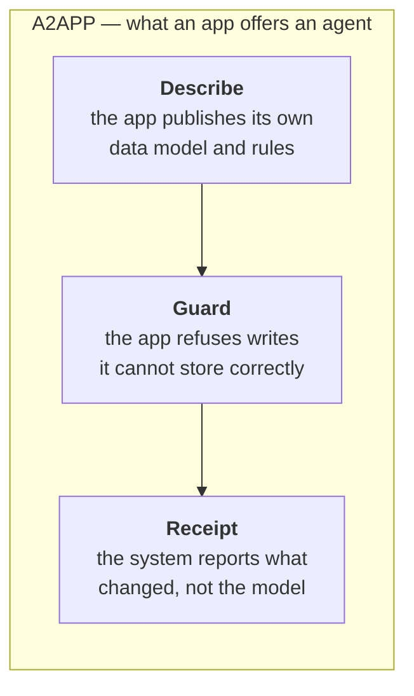
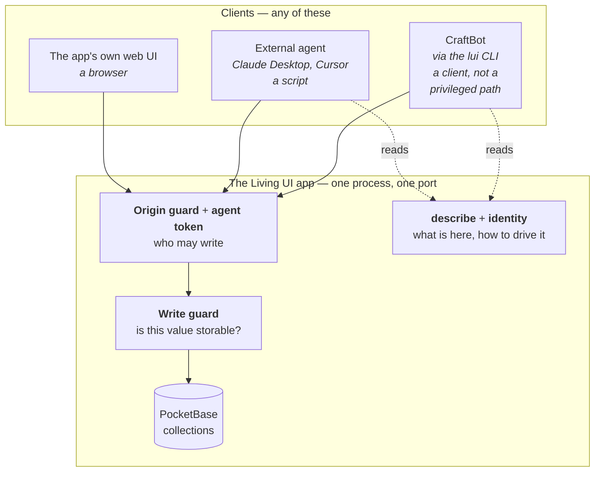
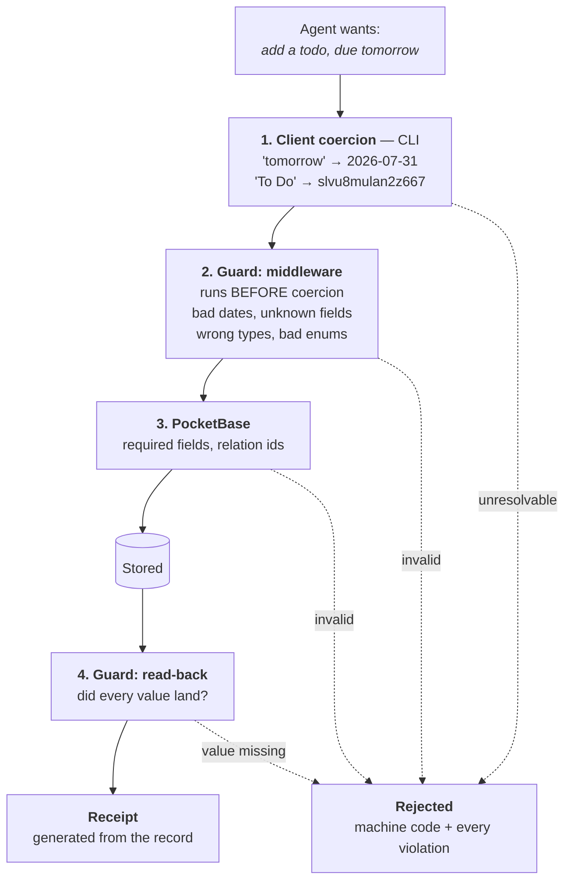
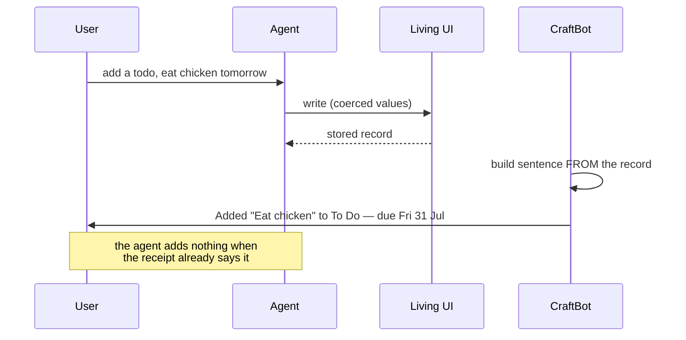
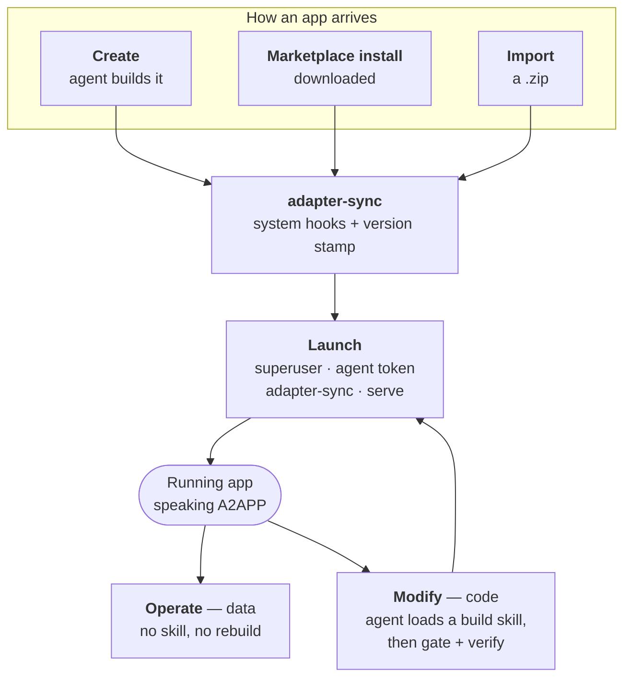
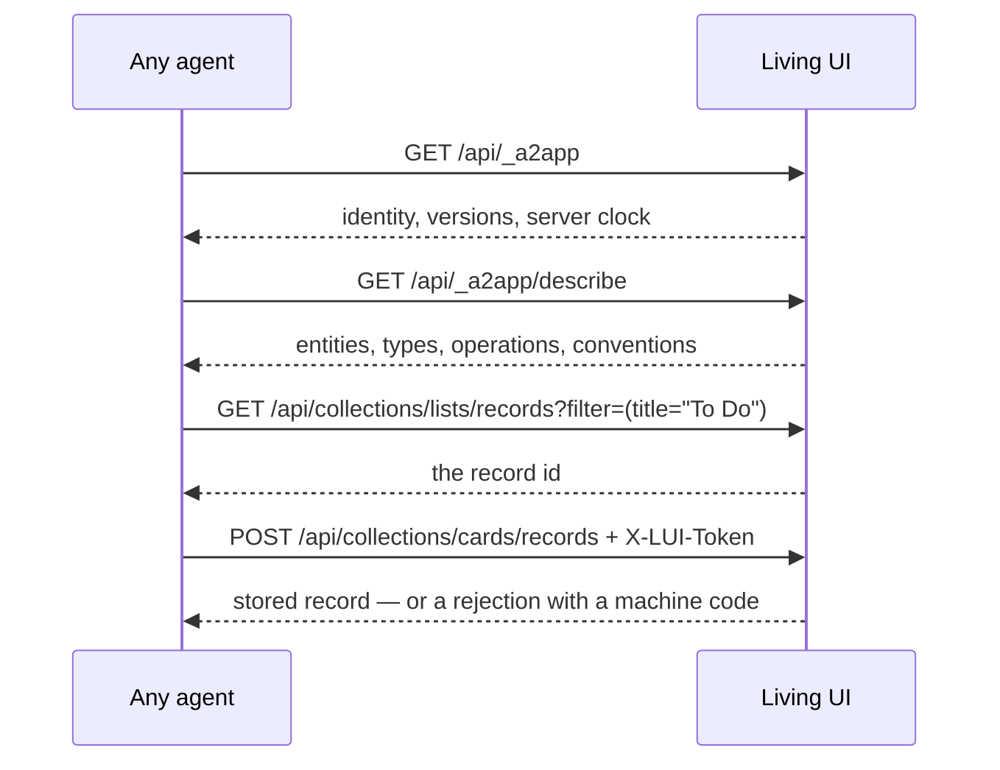
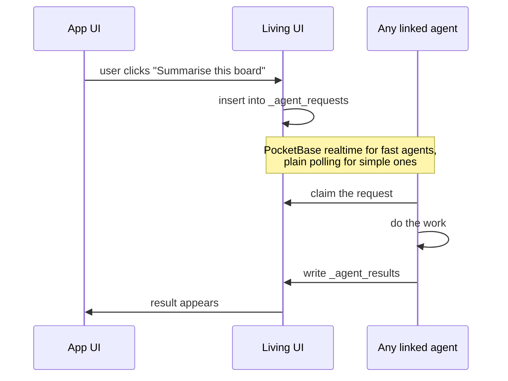
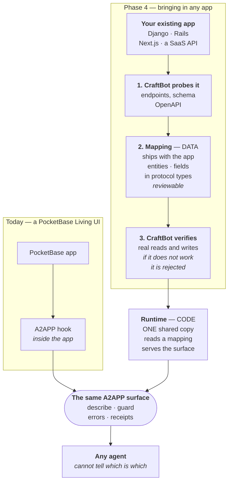
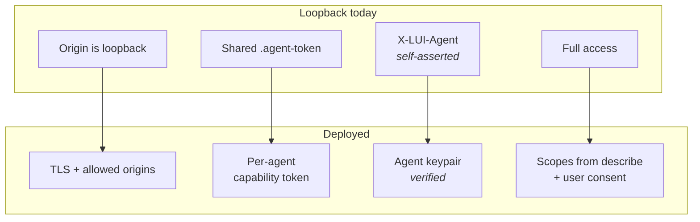

# Living UI + A2APP — System Overview

**The only document you need.** Why the system exists, what it is, how to
program against it, how each kind of app flows through it, and how the parts
that are not built yet attach to the parts that are.

Status: adapter **1.6.0**. §11 states exactly what is built and what is not.

Contents — §1 Why · §2 What · §3 How it works · §4 **The interface** (program
against this) · §5 App pipelines · §6 Any agent, and two-way · §7 Phase 4 ·
§8 **Deployment and per-agent identity** · §9 Where knowledge lives ·
§10 **Constraints and rejected designs** (read before changing anything) ·
§11 Built vs planned · §12 Where to look

---

## 1. Why

A **Living UI** is a real application — database, API, web UI — that an AI agent
builds for a user and can then operate on their behalf. "Add a todo for tomorrow"
should become a row in a database.

The system exists because that turns out to be much harder than it looks, in a
specific and repeatable way. From the incident that started this work:

> A user asked: *"add a todo for me to eat chicken tomorrow"*.
> The agent guessed the collection was `items` (404), invented a CLI flag,
> guessed `tasks` (404), read the database migrations to find the real name,
> looked up a record id, and finally wrote the card with `due_date: "tomorrow"`.
> **PocketBase returned HTTP 200 and stored an empty string.** The agent read
> `"due_date":""` in its own tool output and told the user it was
> *"scheduled for tomorrow"*. It repeated the identical mistake 66 seconds later.

Three failures, and only one of them is the model's fault:

| failure | whose |
|---|---|
| The agent had to **guess** what the app contains | the system's — nothing told it |
| The database **accepted a bad value and reported success** | the system's — a silent 200 |
| The agent **claimed something untrue** | the model's — but nothing stopped it |

The design principle that follows, and which the rest of this document is an
application of:

> **A property that matters must be enforced by the system, not requested of the
> model.** Advisory text was ignored twice — "Read LIVING_UI.md" and `lui ops`
> were both in the prompt, both unused. What worked was making the wrong thing
> impossible, and making errors carry the answer.

---

## 2. What

**A2APP** is the surface a Living UI presents to any agent. Three ideas:



- **Describe** — the app publishes its entities, field types, enum values and
  operating conventions at a URL. No guessing, no reading migrations.
- **Guard** — the app validates every write against its own schema and refuses
  what it cannot store. There is no silent 200.
- **Receipt** — what the user is told is generated from the stored record, so
  the model cannot misreport it.

Each answers one of the three failures above, in the same order.

---

## 3. How it works

### 3.1 Layers

The important structural choice is **where each piece of knowledge lives**,
because that decides who benefits from it.



**Everything that every client needs is inside the app.** The schema, the type
rules, the operating conventions, the guard. An external agent that has never
heard of CraftBot gets the same protection and the same information.

**Everything CraftBot-specific stays outside**: the `lui` CLI, CraftBot's
actions, its skills. Those are one client's tooling, not the contract.

#### Is the CLI required? No — and any client may use it

`lui` is a Node CLI in the CraftBot repo. Nothing gates it: an external agent
with shell access on a machine that has CraftBot installed can call it exactly
as CraftBot does. It usually will not, because Claude Desktop has no shell, a
Python script will not spawn Node to make an HTTP call, and an app running
without CraftBot has no CLI at all — a Living UI needs only the PocketBase
binary at runtime.

**It does not matter, because the CLI adds convenience, not capability.** With
`.superuser` deleted *and* the CLI removed from the loop, an app can be driven
end to end with `curl` and one token — discover, describe, resolve a label,
write, be rejected on a bad date, attribution logged. That test is what makes
the surface real rather than a description of CraftBot's private path.

What the CLI does is client-side work any client can do for itself:

| the CLI does | an agent without it |
|---|---|
| `"tomorrow"` → ISO date | resolves it itself — it has a real clock, which is *why* this is client-side (§10.1) |
| `"To Do"` → record id | one filtered `GET`, exactly as `describe.conventions` documents |
| schema discovery | reads `describe` — the same endpoint the CLI reads |
| readable errors | reads `code` from the JSON |

Giving non-CraftBot agents that same convenience without a shell or Node is
precisely what the parked MCP gateway (§11) is for — which is why it, and not
the protocol, is what makes "any agent" practical rather than merely possible.

> This split is load-bearing. Knowledge kept in a CraftBot skill is knowledge
> Claude Desktop will never have — so the rules for driving an app well
> (*prefer a declared operation*, *confirm destructive ones*, *say so if the app
> can't express it*) live in `describe.conventions`, not in a skill.

### 3.2 The write path

A write passes through four checks. They are ordered so that each one catches
what the one before it cannot see.



Why each layer exists, and why it is where it is:

| layer | catches | why not elsewhere |
|---|---|---|
| **1. Client coercion** | human input: `"tomorrow"`, `"To Do"` | needs a real clock, timezone database and `Intl`. The app's JS runtime has none of them, so resolving dates server-side would be wrong in ways nothing could detect |
| **2. Middleware guard** | bad dates, unknown fields, wrong types, bad enums | **must** run before PocketBase coerces the body — by the time a record hook sees it, `"tomorrow"` and `""` are indistinguishable, and a bad number is already `0` |
| **3. PocketBase** | missing required fields, bad relation ids | already correct; not re-implemented |
| **4. Read-back** | anything requested that did not land | the backstop for whatever the first three did not anticipate |

### 3.3 What the user is told

The model does not report what happened.



The line the user reads is generated from what was stored. If the agent *does*
speak and claims a change when nothing was written, the message is **withheld**
and the discrepancy is handed back to it to correct — the user never sees a
system component contradicting their assistant.

---

## 4. The interface

Everything an agent needs to program against a Living UI. Four calls.

```http
GET  /api/_a2app                                   who is this app
GET  /api/_a2app/describe                          its data model and verbs
GET  /api/collections/{entity}/records?filter=…    read
POST /api/collections/{entity}/records             write   (needs a token)
```

### 4.1 Identity

```json
{ "a2app": true, "protocol": "1.0", "adapterVersion": "1.6.0",
  "app": { "id": "cde3d7c6", "name": "Kanban Board", "pbVersion": "0.39.7" },
  "schemaVersion": "sv_c28c7d1f",
  "serverNow": "2026-07-30 09:15:00Z", "serverTzOffsetMinutes": 60 }
```

Unauthenticated. The name undersells it: this is less *"who are you"* than
**"am I talking to the right thing, and can I trust what I already know about
it?"**

The problem it solves is specific. PocketBase serves its SPA with **HTTP 200 for
any unknown path** — `GET /api/totally-made-up` returns 200 and an HTML page —
so you cannot probe for a Living UI by looking for a 404. Ports are allocated
across 3100–3199, so an agent told *"your app is on 3100"* might reach the right
app, a **different** Living UI whose port shifted, an unrelated dev server, or a
stale process from a previous run. Every one of those answers 200.

| field | the failure it prevents |
|---|---|
| `"a2app": true` | **The marker.** Check this, never a status code. Absent, or HTML came back → not a Living UI. It is the only reliable probe. |
| `app.id` | **Which** app. Identity that survives a port change — confirm it matches the app the user meant, rather than trusting that *something* answered. |
| `protocol` | Which **contract** this speaks: whether you know how to read the rest of the response. |
| `adapterVersion` | Which **implementation** is installed. Deliberately separate from `protocol` — the contract stays stable while the implementation gains fixes. Tells a client whether a known bug is present, and an operator which apps are stale. |
| `pbVersion` | The filter grammar is PocketBase's, and therefore part of this contract (§4.4). This says which dialect you get. |
| `schemaVersion` | Fingerprint of the data model. **Cache `describe` against it.** Without it an agent keeps writing against a schema someone has since changed — silently, because the field it remembers may no longer exist. |
| `serverNow` · `serverTzOffsetMinutes` | The app's clock and zone. Dates are resolved **client-side** (§10.1 — the app's runtime has no `Intl`), so a client needs to know whether its clock agrees. An agent in another timezone, or on a skewed machine, would otherwise disagree with the app about what "tomorrow" means without either side noticing. |

What a client does with it:

```text
1. GET /api/_a2app
2. no "a2app": true?         → this is not a Living UI. Stop.
3. app.id not what I expect? → wrong app. Stop.
4. adapterVersion too old?   → degrade, or ask the user to relaunch it
5. schemaVersion changed?    → re-fetch describe before writing
6. serverNow far from mine?  → my "tomorrow" is not the app's tomorrow
```

Steps 2 and 3 matter most in practice. Without them, an agent writing to
"the app on 3100" is trusting a port number — the least stable thing in the
system.

### 4.2 Describe

```json
{ "entities": {
    "cards": {
      "label": "title",
      "records": "/api/collections/cards/records",
      "fields": {
        "title":    { "type": "string",  "required": true, "max": 255 },
        "list":     { "type": "ref",     "required": true, "entity": "lists" },
        "due_date": { "type": "datetime" },
        "priority": { "type": "enum", "values": ["none","low","medium","high","urgent"] },
        "created":  { "type": "datetime", "readOnly": true } } } },
  "operations": [ … ],
  "conventions": { … } }
```

Generated from the **live** schema on every request, so it cannot drift from
what the app is. `label` is the field a human uses to name a record — use it to
resolve `"To Do"` to an id. `readOnly` fields are server-managed. Write-only
fields (passwords) are never advertised.

**Type vocabulary** — closed, and deliberately not PocketBase's, so a client
written against this works unchanged against any other backend:

| type | wire form |
|---|---|
| `string` | JSON string |
| `number` | JSON number |
| `boolean` | JSON boolean |
| `datetime` | `"2026-07-30"` or `"2026-07-30 00:00:00.000Z"` |
| `enum` | one of `values` |
| `ref` | a 15-char record id of `entity` |
| `list<enum>` / `list<ref>` | array of the above |
| `json` · `binary` | any JSON value · file upload (multipart) |

A `string` carrying `"format": "YYYY-MM-DD"` is a **day key** — a date stored as
text to avoid timezone drift. It is validated as a date despite its type.

`conventions` carries the rules for driving the app *well*, not just legally:
prefer a declared operation over raw collection writes; confirm anything marked
`destructive`; write only what the app's own UI would; and if the app cannot
express what was asked, **say so rather than approximating it into a field that
means something else**.

### 4.3 Authentication

Two **independent** checks, not a menu — depending on who you are and what you
touch, you may need neither, either, or both.

#### Check 1 — may you write at all?

The discriminator is the `Origin` header, and the reason is mechanical: **a
browser always attaches `Origin` to a write; a program never does.** So "no
`Origin`" is a reliable proxy for "this is a program", which lets the rule be
*programs carry a credential* without the app's own web UI needing one.

| where the write comes from | `Origin` | needs |
|---|---|---|
| the app's own web UI | its own loopback origin | **nothing** |
| CraftBot, an agent, `curl` | none sent | **`X-LUI-Token`** |
| any other website the user is visiting | a foreign origin | **refused — 403** |

That third row is the attack this closes: without it, any page you happened to
have open could read and write every Living UI on your machine.

#### Check 2 — who are you acting as?

Only applies to `authMode: multi-user` apps. There, operations run as a
principal, so `/api/ops/*` additionally requires a **PocketBase auth token** —
the same one the app's own users sign in with.

So a script hitting an operation on a multi-user app carries **both**:
`X-LUI-Token` (it is a program) and a PocketBase token (it is acting as
someone). On a single-user `authMode: none` app, check 2 does not exist.

#### Where the token lives, and what it is not

`.agent-token` in the project directory, mode 0600, created at launch.

**It is a credential you can hand out, not a sandbox.** 0600 does not stop
another process running as the same user from reading it — and that is the
correct model for a loopback app, the same one Home Assistant and Obsidian's
local API use. What it buys is a deliberate act: giving an outside agent write
access means giving it something, rather than it being ambient.

#### Not authentication: `X-LUI-Agent`

Send `X-LUI-Agent: <your-agent-id>` on writes. It is **self-asserted and
unverified** — anyone can claim any name, so it defends against nothing.

It exists for a different problem. Every change is recorded against it in
`logs/agent-actions.jsonl`, so when several agents share an app you can tell
which one wrote what. Useless against malice; exactly right against confusion,
which is the failure that actually happens.

### 4.4 Reading

`GET {entity.records}` with PocketBase's `filter`, `sort`, `page`, `perPage`,
`expand`.

> **The filter grammar is PocketBase's, which makes it part of this contract.**
> Its operators and escaping are pinned with the PocketBase version in
> [`pocketbase.version`](pocketbase.version). Treat that pin as load-bearing for
> the protocol, not just for builds: an upgrade that changes filter semantics is
> a breaking change here.

### 4.5 Writing

```http
POST   {entity.records}          PATCH {entity.records}/{id}          DELETE …/{id}
```

**Dates** — send ISO 8601. Relative words are **rejected**: `"tomorrow"` is a
400, not a date. Resolve them client-side, where a real clock and timezone
database exist.

**References** — send a record id. To resolve a label:
`GET /api/collections/lists/records?filter=(title="To Do")`.
**More than one match is ambiguous, not a choice** — across the shipped apps no
relation field has a unique index on its label, so multi-match is the normal
case. Ask, or fail; never pick.

**Retries** — send `Idempotency-Key` on a write you might repeat. A replay
returns **409** naming the record the first attempt created. Reject-duplicate,
not replay-the-response; scoped per entity, 24h, in memory.

**Quote your values.** An unquoted `#` starts a shell comment and silently
removes the rest of the command — this stored `"true"` in a colour field in
testing.

### 4.6 Errors

Branch on `code`, never on prose.

```json
{ "a2app": true, "ok": false,
  "code": "invalid_date", "field": "due_date",
  "expected": "an ISO 8601 date", "got": "tomorrow",
  "message": "Rejected by a2app (invalid_date): field \"due_date\" expects …",
  "violations": [ { "code": "invalid_date", "field": "due_date", … },
                  { "code": "unknown_field", "field": "bogus", … } ] }
```

`violations` lists **every** problem, so one round trip fixes them all. The
`a2app: true` marker distinguishes these from PocketBase's own rejections.

| code | meaning |
|---|---|
| `unknown_field` | not a field of this entity (message lists the valid ones) |
| `read_only_field` | server-managed |
| `invalid_date` · `invalid_daykey` | not ISO 8601 · not `YYYY-MM-DD` |
| `invalid_string` · `invalid_number` · `invalid_boolean` · `invalid_enum` | wrong type |
| `not_stored` | requested, accepted, but absent from storage — failed, not partial |
| `duplicate_request` | this `Idempotency-Key` already produced a record (409) |

Plus, at the transport layer: `403 forbidden origin`, `401 agent token
required`, `401 authentication required`.

**Every one of these was once a silent HTTP 200.**

---

## 5. App pipelines

An app can enter the system four ways, and be used two ways. Every path
converges on the same operating surface.



**Every path is stamped on the way through.** `adapter-sync` runs at create,
install, import **and every launch** — the last one matters most, because it is
the only path that reaches an app a user already had. Without it the whole
system would apply solely to apps installed after it shipped.

### Operate vs modify

The agent decides which it is, per request — nothing is routed in advance:

| the user says | the agent does |
|---|---|
| "add a todo for tomorrow" | one write. No skill, no rebuild, no browser |
| "mark it complete" | one write |
| "add a button that exports to markdown" | loads a build skill, edits code, runs the gate, verifies |

Getting this wrong is expensive: a data write that triggers the build sequence
rebuilds and relaunches a live app and drives a headless browser over the user's
real records. It used to, because a build skill was preloaded into every
session. Now skills load **per run**, chosen by the agent from the request.

---

## 6. Any agent, and two-way

### 6.1 Today — agent drives app

An agent needs four calls and one credential. No CraftBot, no CLI, no Node.



This is verified: with `.superuser` deleted and the CLI removed from the loop,
an app can be driven end to end with `curl` and one token. **Anything CraftBot
can do, an external agent can do**, which is what makes the surface real rather
than a description of CraftBot's private path.

### 6.2 Later — app drives agent (Phase 5)

Two-way means a button in the app can ask *an* agent to do something. The
mechanism is deliberately boring: **a queue collection**, because any agent can
poll REST and almost none can receive a webhook or hold a socket open.



**The security shape is the point, not the transport.** An app that can ask an
agent to act, combined with third-party apps, means an app someone else wrote
could drive the user's agent — which holds their email, calendar and payment
integrations. So Phase 5 requires, from day one:

- a **declared capability vocabulary** in the manifest — exactly which agent
  actions this app may request
- **consent at install**, per capability, in words the user can evaluate
- **no arbitrary passthrough**, ever

That last rule is not theoretical: the existing CraftBot integration bridge had
exactly that shape — caller-controlled destination with the user's real
credentials attached — and it is now gated by an allowlist plus a per-project
capability check.

---

## 7. Phase 4 — any technology

**What it buys you:** point CraftBot at an app written in *anything* — Django,
Rails, Next.js, a SaaS with a REST API — and it becomes a Living UI. From that
moment every agent drives it exactly as it drives a PocketBase one, and cannot
tell the difference.

Today A2APP is a PocketBase hook, and a Django app cannot run one. Phase 4 adds
a **fourth arrival path** to the pipeline in §5.



### What actually happens

1. **You point CraftBot at the app** — import it, or have CraftBot build it in
   whatever stack you asked for.
2. **CraftBot probes it** and writes a **mapping**: which entities exist, which
   fields they have *in protocol types* (`datetime`, `ref`, `enum` — not
   Django's or Rails' types), and how to reach them.
3. **CraftBot verifies the mapping** by performing real reads and writes. A
   mapping that does not actually work is rejected rather than shipped — this is
   the step that stops a plausible-looking but wrong mapping getting published.
4. **The shared runtime** reads that mapping and serves `describe`, the guard,
   the error contract and receipts — the same surface §4 documents.

After step 4 the app is a Living UI in every way that matters to an agent.

### Why this shape, and not a hook per technology

- **The runtime is code, and shared.** A date-parsing bug is one fix, not a
  migration across every app ever installed. The opposite arrangement — logic
  shipped inside each app — is what killed the first architecture (§10.2).
- **The mapping is data, not code.** That is what makes it safe to publish
  someone else's adapter: a mapping can be read and validated, where code would
  have to be trusted. Some APIs will need a code escape hatch; those are exactly
  the ones a human should review.
- **Clients need no change.** The CLI and every external agent already speak
  protocol types rather than PocketBase's, precisely so a new backend costs
  nothing on the client side.

### What stays in-app for PocketBase

Write verification and identity remain a PocketBase hook even after Phase 4,
because they must protect callers that never go through any runtime — someone
hitting `/api/collections/...` directly still gets the guard.

### Honest limits

Not every API will map declaratively. The pipeline needs an explicit *"I cannot
map this"* outcome rather than emitting a mapping that looks right and is subtly
wrong — which is why step 3 exists and must not be skipped.

## 8. Deployment and per-agent identity

Everything so far assumes the app is on **loopback**, on the user's own machine.
That assumption is doing real work, and the moment an app is deployed somewhere
reachable it stops holding.

### 8.1 What breaks when you deploy

| today's mechanism | why it works on loopback | what happens deployed |
|---|---|---|
| **Origin guard** — foreign origins refused | the only legitimate browser is the app's own UI | there are now legitimate remote origins; "loopback" stops being the test |
| **Agent token** — a 0600 file | any agent that can read the file is already running as the user | a remote agent cannot read a local file, and one shared token cannot distinguish two agents |
| **`X-LUI-Agent`** — self-asserted | fine: everything local is already trusted | anyone can claim any name — worthless once callers are untrusted |
| **All-or-nothing access** | a local agent already has full machine access | a remote agent should get *some* access, not all of it |

The shared token is the crux: it answers *"is this a program?"*, not
*"which program, acting for whom, allowed to do what?"* Deployment needs the
second question answered.

### 8.2 What replaces each



**Agent identity becomes a keypair.** An agent generates its own; the public
half *is* its identity. There is no registry to join — identity is free, and
**trust** is granted per app by its owner.

**Access becomes a grant.** A grant binds three things: *which agent key*,
*which user it acts for*, and *which scopes*. Effective permission is the user's
own permission **intersected** with the granted scopes, so an agent can never
exceed the person it acts for.

**Scopes are derived, not invented.** They come straight out of `describe`:
`op:<name>` for each declared operation, `data:<entity>:read|write` for each
entity. There is no second permission vocabulary to keep in step — the thing an
agent reads to learn the app is the same thing the consent screen is built from.

### 8.3 The flow

```mermaid
sequenceDiagram
    participant Ag as Agent
    participant App as Deployed Living UI
    participant U as Owner

    Ag->>App: request access<br/>public key · scopes · reason
    App->>U: consent screen<br/>who · what · as whom
    U-->>App: approve → a Grant is stored
    Ag->>App: exchange for a token<br/>(proves it holds the private key)
    App-->>Ag: short-lived capability token
    Ag->>App: writes, carrying the token
    Note over App: every call checked against<br/>scopes ∩ the user's own permission
    Note over App: every call audited; owner can revoke,<br/>which kills refresh within one TTL
```

Consent is **human** — no agent approves another agent's access. Anything marked
`destructive` can additionally require confirmation *per call* rather than
riding on the standing grant.

### 8.4 Two-way, with identity

Deployment changes the app→agent direction too. Today the request queue is open:
any linked agent may claim any request. Deployed, a queued request must name
**which grant** may claim it, and the claimer must present its token.

| direction | loopback today | deployed |
|---|---|---|
| agent → app | shared token | capability token, scope-checked per call |
| app → agent | any agent polls the queue | request names an eligible grant; claimer authenticates |

And the reason this matters more than it may seem: an app that can ask an agent
to act, combined with apps written by third parties, means **someone else's app
could drive your agent** — which holds your mail, calendar and payment
integrations. So the capability declaration and install-time consent described
in §6.2 are not optional extras; they are what makes the direction shippable at
all.

### 8.5 Why today's design already accepts this

None of the above requires unpicking what exists. The current pieces are the
degenerate single-agent case of the same shapes:

| exists now | becomes |
|---|---|
| `describe` publishes entities and operations | **the scope vocabulary**, unchanged |
| the guard checks every write | the place a **scope check** slots in beside it |
| `X-LUI-Agent` names the caller | the field a **verified key** fills |
| one shared `.agent-token` | one grant, for one agent, with every scope |
| `agent-actions.jsonl` | the **audit trail** consent and revocation need |

That is the payoff of keeping protocol knowledge in the app rather than in one
client's tooling (§3.1): the thing an agent reads to learn an app is the same
thing its owner reads to decide what to allow.

### 8.6 The mechanics, settled

The decisions behind §8.2–8.4, and why each went the way it did:

| decision | choice | why |
|---|---|---|
| **Where authority lives** | in the app | the app is the authority over its own access. Hosting adds TLS, rate limits, backups — never the capability itself, so a self-hosted app is not second-class |
| **Agent identity** | self-generated keypair | no central registry to join. Identity is free; *trust* is what an owner grants, per app |
| **Token format** | the app's own auth records | the verifier is always the issuer — a token for app X is only ever presented to app X — so signed offline-verifiable tokens buy nothing, and deleting the record *is* instant revocation. No blocklists, no crypto surface |
| **Token lifetime** | short, refreshed by proof-of-possession | refresh means signing a server challenge with the private key, so a leaked bearer token dies at expiry and cannot be renewed |
| **Scope granularity** | coarse: `op:<name>` and `data:<entity>:read\|write` | a permission an owner cannot evaluate in seconds gets approved blindly. Record-level safety comes free from the intersection in §8.2, not from finer scopes |
| **Who consents** | a human, always | no agent approves another agent. The grant record reserves a field for delegated policy, so that could change later without a migration |
| **Destructive operations** | may demand consent per call | a standing grant should not silently cover "delete everything" |
| **Trust tiers** | any agent key + consent (default); optionally only attested keys | the strict tier filters anonymous spray, but consent is still required either way, and the default works with no external service |

Grants and agent keys live in system-managed collections inside the app —
invisible to app code, surviving a kit sync. Every token-authenticated call is
logged with the agent's fingerprint, the principal, the scope used and the
outcome; the owner sees that list and can revoke any grant in one click, which
cuts off refresh immediately and ends access within one token lifetime.

**What this defends against.** A stolen token dies at expiry and cannot be
refreshed without the private key. A rogue agent that *has* consent is still
bounded by scopes ∩ its principal, audited, and revocable. Exceeding the user it
acts for is impossible by construction rather than by policy. And because
authority sits in the app, compromising the hosting platform does not hand over
the apps.

**Status: designed, not built.** Deliberately deferred until apps are actually
deployed — on loopback it would add ceremony without adding safety, and the
degenerate single-agent case (§8.5) already covers that setting.

---

## 9. Where knowledge lives

The single most useful table in this document. When adding something, ask which
row it belongs to.

| knowledge | lives in | why |
|---|---|---|
| entities, field types, enum values | **the app** (`describe`) | every client needs it; generated live so it cannot drift |
| how to drive the app well | **the app** (`describe.conventions`) | an external agent has no access to CraftBot's skills |
| what is a valid value | **the app** (guard) | the last line every caller passes |
| turning `"tomorrow"` into a date | **the client** | needs a clock, timezone data, `Intl` — the app's runtime has none |
| the `lui` CLI, CraftBot actions | **CraftBot** | one client's tooling |
| how to build/modify an app | **a skill, loaded per run** | only relevant to the run that is doing it |

---

## 10. Constraints and rejected designs

Read this before changing anything. Each item was measured, and several
architectures died on them.

### 10.1 Verified constraints

| constraint | consequence |
|---|---|
| **PocketBase coerces the request body *before* record hooks run.** `{"due_date":"tomorrow"}` reaches a record hook as an empty DateTime — **identical** to `{"due_date":""}`. A bad number is already `0`. | Validation must be **router middleware**. A record hook cannot tell "clear this field" from "I sent garbage", and cannot see bad numbers or booleans at all. |
| **The JS runtime has no `Intl`**, and `toLocaleDateString` silently ignores both `timeZone` and locale, using the server's zone. | Date *resolution* cannot happen in the app. The client resolves; the app only validates. Rejecting `"tomorrow"` needs no clock — converting it does. |
| **`runInTransaction` with the outer handle deadlocks the process permanently**, and `/api/health` keeps returning 200 throughout. | One mistake in one hook turns an app into a read-only zombie that passes its own health check. The build gate rejects `e.app`/`$app` inside a transaction callback. |
| **Hook callbacks run in isolated VMs that cannot see their own file's scope.** | Every callback must reach shared code through `require()`. A file-scope helper fails with `ReferenceError`. This trap was hit *after* being documented. |
| **PocketBase capitalises error messages** and recursively normalises the `data` map of any thrown error. | A machine-readable code cannot survive the throw path — the guard **returns** a response from middleware instead. A case-sensitive prefix match on a message silently fails. |
| **`f.type` is a method, not a property.** | Reading it as a property yields a Go func; `e.json()` then emits a zero-length HTTP 200 with the error only in the server log. |
| **No relation field in any shipped app has a unique index on its label.** A board's lists are seeded `To Do / In Progress / Done` for *every* board. | Ambiguity is the normal case for label resolution, not an edge case. Never guess. |
| **Some date fields are deliberately `text`** (`tasks.due`, `entries.day` — "day key as plain text, avoids timezone drift"). | A type check cannot protect them. Writing `"tomorrow"` stores it verbatim, *looks* populated, and breaks ordering permanently (`"t"` > `"2"`). Hence the day-key convention. |

### 10.2 Designs that were tried and rejected

**A server-side operation runtime inside each app.** Killed by four of the
constraints above at once — no `Intl`, the transaction deadlock, `$app.save()`
bypassing API rules, and no delivery path for code shipped inside apps.

**Auto-generated CRUD verbs per collection.** Zero of the shipped apps use the
existing `crud` executor, and renaming `cards create` to `cards.add` fixes
nothing about *values*, which was the actual failure. It would also have
inflated the surface from a handful of verbs to ~168.

**A three-verb protocol (`describe`/`bind`/`invoke`).** It had no read verb, its
timezone claim was false across a DST boundary, its "changes" guarantee could
not be honoured, it cost **+25k tokens per write** against schema-in-context,
and a paper published in May 2026 had already shipped the same idea with six
verbs and an evaluation.

**A general `undo`.** Most relations cascade on delete, there are no backups,
and one app sends real email. A partial undo is worse than none — it manufactures
relief exactly when the user stops checking.

**Routing capability by session.** Skills were bound to sessions at creation,
which encodes *how the project arrived* rather than *what is being asked*. Now
they load per run.

### 10.3 The recurring lesson

Three separate defects were found by **writing something down** or **counting
rows**, not by testing:

- `describe` advertised `email` as read-only, so no client would ever have
  attempted a signup.
- The error `data` map was unusable, so "branch on `code`" was undeliverable.
- Idempotency keys silently never matched, because two code paths computed them
  differently — every negative test passed while duplicates sailed through.

Negative tests prove bad things fail. They do not prove the contract you are
promising is the one you built.

---

## 11. Built vs planned

| | state |
|---|---|
| Describe, identity, guard, read-back backstop | **built**, adapter 1.6.0 |
| Agent token, origin guard, ops auth, rate limits | **built** |
| Idempotency (`Idempotency-Key`) | **built** |
| System-authored receipts, false-claim gate | **built** |
| CLI as a thin client (no superuser needed) | **built**, verified by driving an app with curl alone |
| Adapter delivery at create/install/import/launch | **built** |
| Per-run skill selection | **built** |
| Collection rules still open (`''`) | **known** — the origin guard closes the browser attack; see §11, "collection rules" |
| `walk_verify` clicks UI buttons, can touch live data | **known defect** |
| Bulk writes across many turns produce many receipt lines | **known** |
| Registry + MCP gateway (one install, every agent) | **parked** |
| Any-technology mapping + runtime | **parked** (Phase 4) |
| App → agent, capabilities, consent | **parked** (Phase 5) |

---

## 12. Where to look

| what | where |
|---|---|
| the guard, describe, identity | `blueprint/pb/pb_hooks/_a2app*.js` |
| validation rules (pure, portable) | `blueprint/pb/pb_hooks/_a2app_rules.js` |
| origin guard, ops auth, rate limits | `blueprint/pb/pb_hooks/_system.pb.js` |
| client coercion, schema access | `tools/src/lib/schema.ts` |
| CLI commands | `tools/src/commands/` |
| receipts, false-claim gate | `app/agent_base.py` |
| adapter delivery, token, launch | `app/living_ui/v2_runner.py` |
| session + skill selection | `app/living_ui/manager.py` |
| a runnable check of every guarantee | `scripts/a2app-selfcheck.sh` |
