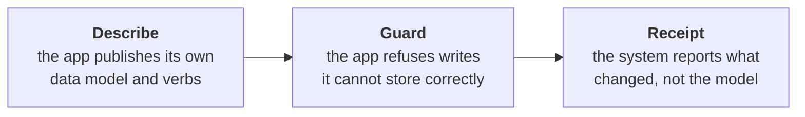
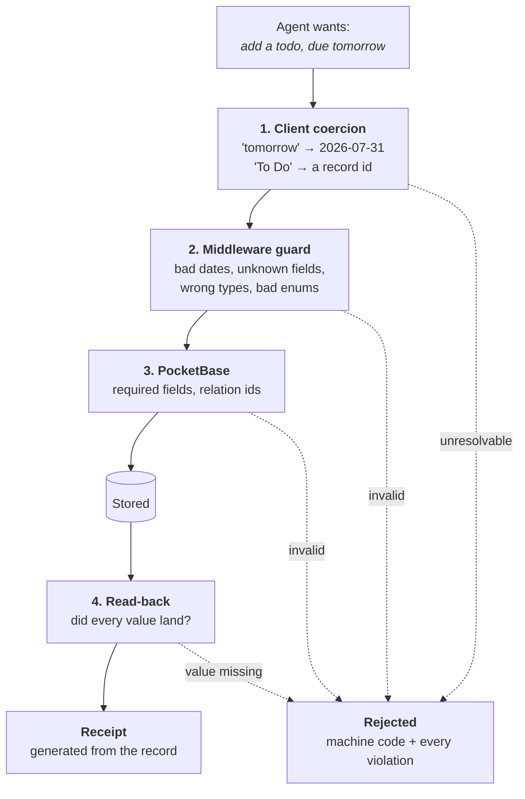
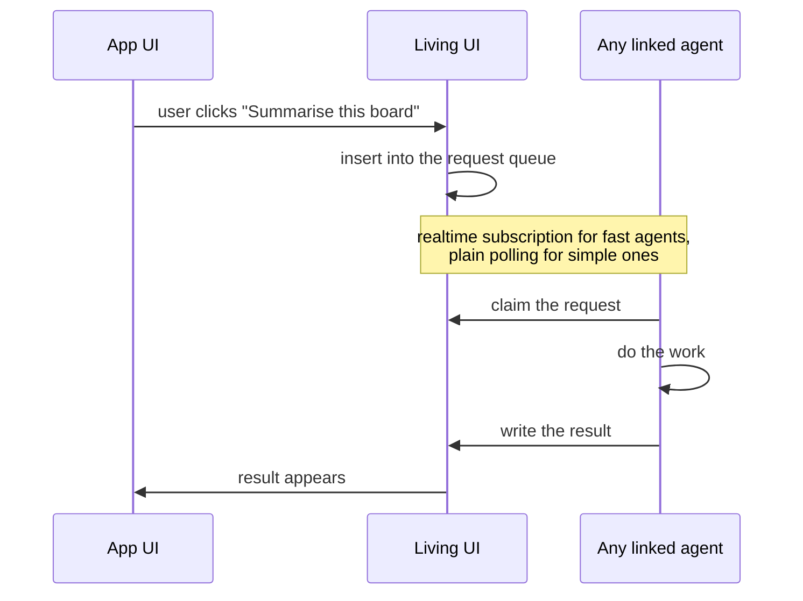

# The A2App protocol

A2App is the contract a Living UI presents to **any** agent: CraftBot, an external agent, or a plain script. It exists because letting a model write to a database it has to guess about fails in a specific, repeatable way: the agent guesses a collection name, the database accepts a bad value with a silent HTTP 200, and the model reports success for something that never happened.

The design principle, applied throughout: **a property that matters is enforced by the system, not requested of the model.** A2App answers each failure with a structural guarantee:



Everything every client needs lives **inside the app**: schema, type rules, operating conventions, guard, audit. CraftBot's own tooling (the `lui` CLI, its actions, its skills) is one client of the same surface; an agent that has never heard of CraftBot gets the same information and the same protection. This is verified, not aspirational: an app can be driven end to end with `curl` and one token.

## The surface

| Endpoint | Purpose |
|---|---|
| `GET /api/_a2app` | Identity: which app this is, which contract it speaks, its clock |
| `GET /api/_a2app/describe` | The data model: entities, fields, types, plus operating conventions |
| `GET /api/_ops` | The verb surface: every declared operation with typed parameters |
| `GET /api/collections/{entity}/records` | Read, with PocketBase's `filter`, `sort`, `page`, `perPage`, `expand` |
| `POST/PATCH/DELETE /api/collections/{entity}/records[/{id}]` | Guarded record writes (token required) |
| `POST /api/ops/{name}` | Invoke a declared operation |
| `GET /api/_jobs/{jobId}` | Poll a long-running job started by a `job` operation |

### Identity

```json
{ "a2app": true, "protocol": "1.0", "adapterVersion": "1.6.0",
  "app": { "id": "cde3d7c6", "name": "Kanban Board", "pbVersion": "0.39.7" },
  "schemaVersion": "sv_c28c7d1f",
  "serverNow": "2026-07-30 09:15:00Z", "serverTzOffsetMinutes": 60 }
```

Unauthenticated, and more than a greeting. PocketBase answers **HTTP 200 for any unknown path**, so a status code can never tell you whether the thing on a port is a Living UI, a different Living UI whose port shifted, an unrelated dev server, or a stale process. The identity call is the only reliable probe:

| Field | The failure it prevents |
|---|---|
| `a2app: true` | Talking to something that is not a Living UI. Absent, or HTML came back: stop |
| `app.id` | Writing to the wrong app. Identity survives a port change; confirm it matches the app the user meant |
| `protocol` / `adapterVersion` | Contract versus implementation. The contract stays stable while the adapter gains fixes; a client can detect a known bug or a stale app |
| `pbVersion` | The filter grammar is PocketBase's and therefore part of this contract; this says which dialect you get |
| `schemaVersion` | Writing against a stale schema. Cache `describe` against this fingerprint and re-fetch when it changes |
| `serverNow` / `serverTzOffsetMinutes` | The app's clock and zone, so a client can tell whether its own clock agrees before sending date-based writes |

### Describe

`GET /api/_a2app/describe` returns entities, fields, and conventions, generated from the **live** schema on every request so it cannot drift:

```json
{ "entities": {
    "cards": {
      "label": "title",
      "records": "/api/collections/cards/records",
      "fields": {
        "title":    { "type": "string",  "required": true, "max": 255 },
        "list":     { "type": "ref",     "required": true, "entity": "lists" },
        "due_date": { "type": "datetime" },
        "priority": { "type": "enum", "values": ["none","low","medium","high","urgent"] } } } },
  "operations": [ ... ],
  "conventions": { ... } }
```

The type vocabulary is closed and deliberately backend-neutral, so a client written against it works unchanged against any other backend:

| Type | Wire form |
|---|---|
| `string` / `number` / `boolean` | JSON primitive |
| `datetime` | `"2026-07-30"` or `"2026-07-30 00:00:00.000Z"` |
| `enum` | one of `values` |
| `ref` | a 15-char record id of `entity` |
| `list<enum>` / `list<ref>` | array of the above |
| `json` / `binary` | any JSON value / file upload (multipart) |

A `string` carrying `"format": "YYYY-MM-DD"` is a **day key**: a date stored as text to avoid timezone drift, validated as a date despite its type. `label` names the field a human uses to identify a record (resolve `"To Do"` to an id with one filtered GET). `readOnly` fields are server-managed; write-only fields (passwords) are never advertised.

`conventions` carries the rules for driving the app *well*, not just legally: prefer a declared operation over raw collection writes, confirm anything marked `destructive`, write only what the app's own UI would, and if the app cannot express what was asked, say so rather than approximating it into a field that means something else. These rules live in the app, not in CraftBot, precisely so an external agent gets them too.

### Operations

Collections are the app's nouns; **operations are its verbs**: the actions the app's author decided outsiders may invoke. They are declared in the project's `operations.json`, validated by the build gate (every declared route must exist, every route should be declared), and discovered at `GET /api/_ops`.

Each operation declares a unique name (`items.clear-done`), a description, **typed parameters** (string/number/boolean, with `required`, `default`, and `enum` constraints), and an executor:

| Executor | Meaning |
|---|---|
| `http` | The normal case: a server hook route. Parameters become the JSON body (POST/PUT/PATCH) or query string (GET/DELETE) |
| `crud` | A declarative pointer to parameterized collection CRUD, optionally with a fixed filter. No hook code needed |
| `job` | Long-running work. The route returns `{"jobId": ...}` immediately; progress is polled at `GET /api/_jobs/{jobId}` |

Two flags change how hosts treat an operation:

- `destructive: true` marks operations that delete or overwrite data. Hosts confirm with the user before running one, and future access grants may require per-call consent for them.
- `schedule` (`"every 15m"`, `"daily 09:00"`, `"hourly"`) declares recurring work the app wants run.

### The write path

A write passes through four checks, ordered so each catches what the one before it cannot see:



Each layer sits where it does for a measured reason: coercion of human input happens on the **client** (which has the clock and locale to do it); the guard runs in **middleware before PocketBase coerces the body**, because after coercion a garbage value and a deliberate "clear this field" are indistinguishable; PocketBase keeps what it already does well (required fields, relation ids); and the **read-back** is the backstop for anything the first three did not anticipate: a value that was accepted but did not land is an error (`not_stored`), never a partial success.

### Authentication

Two independent checks, not a menu; depending on who you are and what you touch, you may need neither, either, or both.

**Check 1: may you write at all?** The discriminator is the `Origin` header, for a mechanical reason: a browser always attaches `Origin` to a write, and a program never does.

| Where the write comes from | `Origin` | Needs |
|---|---|---|
| The app's own web UI | its own loopback origin | nothing |
| CraftBot, an agent, `curl` | none sent | **`X-LUI-Token`** |
| Any other website you have open | a foreign origin | **refused (403)** |

That third row is the attack this closes: without it, any web page you happened to have open could read and write every Living UI on your machine. The token lives at `.agent-token` in the project directory (0600, created at launch). It is a credential you can deliberately hand to an outside agent, not a sandbox: handing out write access is an act, never ambient.

**Check 2: who are you acting as?** Only on `authMode: multi-user` apps, where operations run as a principal: `/api/ops/*` additionally requires a PocketBase auth token, the same one the app's own users sign in with. A script hitting an operation on a multi-user app carries both headers; on a single-user app, check 2 does not exist.

**Attribution, not authentication.** Writes also carry `X-LUI-Agent: <agent-id>`. It is self-asserted and verifies nothing; it exists so `logs/agent-actions.jsonl` records which agent wrote what when several agents share an app. Useless against malice, exactly right against confusion.

### Reading and writing

Reads use PocketBase's `filter`, `sort`, `page`, `perPage`, `expand`. The filter grammar is PocketBase's and is pinned with the PocketBase version as part of the contract: an upgrade that changes filter semantics is a breaking change here.

Writes follow four rules:

- **Dates are ISO 8601.** Relative words like `"tomorrow"` are rejected; resolve them before sending.
- **References are record ids.** Resolve a label with a filtered GET first. More than one match is **ambiguous, not a choice**: ask or fail, never pick. (Every kanban board seeds its own "To Do" list; multi-match is the normal case, not an edge case.)
- **Retries carry `Idempotency-Key`.** A replay returns 409 naming the record the first attempt created (reject-duplicate, scoped per entity, 24h).
- **Everything is validated and read back.** See the write path above.

### Errors

Branch on `code`, never on prose. Every rejection carries the `a2app: true` marker (distinguishing it from PocketBase's own errors) and lists **every** violation, so one round trip fixes them all:

```json
{ "a2app": true, "ok": false,
  "code": "invalid_date", "field": "due_date",
  "expected": "an ISO 8601 date", "got": "tomorrow",
  "violations": [ { "code": "invalid_date", "field": "due_date" },
                  { "code": "unknown_field", "field": "bogus" } ] }
```

| Code | Meaning |
|---|---|
| `unknown_field` | Not a field of this entity (the message lists the valid ones) |
| `read_only_field` | Server-managed |
| `invalid_date` / `invalid_daykey` | Not ISO 8601 / not `YYYY-MM-DD` |
| `invalid_string` / `invalid_number` / `invalid_boolean` / `invalid_enum` | Wrong type |
| `not_stored` | Accepted but absent from storage: failed, not partial |
| `duplicate_request` | This `Idempotency-Key` already produced a record (409) |

Plus transport-level `403 forbidden origin` and `401` for a missing agent token or missing authentication. Every one of these was once a silent HTTP 200.

### Receipts

The model does not report what happened. When the agent writes to an app, the confirmation you read (*Added "Eat chicken" to To Do, due Fri 31 Jul*) is generated by CraftBot **from the stored record**. If the agent claims a change when nothing was written, its message is withheld and the discrepancy is handed back to it to correct; you never see a system component contradicting your assistant.

## Transports

The contract is HTTP; every transport is a client of it. For CraftBot's agent the **`lui` CLI is the primary way to drive an app**, and **raw HTTP is the fallback** for the cases the CLI does not cover. What exists today and what is planned:

| Transport | Status | Role |
|---|---|---|
| **The `lui` CLI** | Available | **Primary.** CraftBot's client: resolves the project's port, authenticates, validates parameters against the live schema, coerces human input (`"tomorrow"` to a date, `"To Do"` to a record id), and prints readable errors. Nothing gates other shell-capable agents from using it too |
| **HTTP** | Available | **The contract, and the fallback.** Four calls and one credential drive any app from any language; no CraftBot, no CLI, no Node required. CraftBot drops down to it when the CLI cannot express a call |
| **Realtime subscriptions** | Available | PocketBase realtime, used by every app's own UI to live-update without polling. Fast agents can subscribe the same way |
| **MCP gateway** | Planned | One installed gateway exposing every local Living UI to MCP-speaking agents that have no shell (Claude Desktop, IDEs). This is what turns "any agent" from possible into practical |
| **App-to-agent queue** | Planned | The reverse direction; see below |

What the CLI adds is client-side work any client can do for itself:

| The CLI does | An agent without it |
|---|---|
| `"tomorrow"` to an ISO date | resolves it itself before sending |
| `"To Do"` to a record id | one filtered GET, exactly as `describe.conventions` documents |
| schema discovery | reads `describe`, the same endpoint the CLI reads |
| readable errors | reads `code` from the JSON |

### Why the CLI, and not MCP

For an agent that has a shell, the CLI beats an MCP gateway on every axis that matters here:

- **No middleman.** The CLI is a thin client that talks straight to the app. An MCP gateway is a long-running server between agent and app: one more process to install, keep alive, and keep in sync.
- **Always current, no registration.** The CLI reads the app's live `describe` on use, so a schema change is visible immediately. An MCP gateway must expose per-app tool definitions, which means registering every app and re-syncing tools whenever a schema changes.
- **Cheaper in context.** CLI calls cost a command line. Loading every app's operations as MCP tool schemas puts the whole surface in the agent's context up front; a measured predecessor of this design cost tens of thousands of extra tokens per write compared to reading the schema on demand.
- **Composable.** The CLI pipes, scripts, and loops like any other command, so multi-step operations stay in one shell session instead of many round trips through a gateway.
- **Same guarantees either way.** Guard, receipts, and errors live in the app, so the CLI adds convenience without creating a privileged path that MCP clients would lack.

MCP still has a place, which is why the gateway is on the roadmap: it is for agents that have **no shell at all**. For those clients MCP is the only practical transport; for everything else it is an extra hop.

## Bidirectional communication

Today the direction is agent-drives-app. The planned reverse direction lets a **button in the app ask an agent to do something**: "Summarise this board" inserts a request into a queue collection inside the app; a linked agent claims it, does the work, and writes the result back.



The mechanism is deliberately boring (a queue collection, because any agent can poll REST and almost none can receive a webhook), and the security shape is the point. An app that can ask an agent to act, combined with third-party apps, means an app someone else wrote could drive an agent that holds your mail, calendar, and payment integrations. So this direction ships only with:

- a **declared capability vocabulary** in the manifest: exactly which agent actions this app may request,
- **consent at install**, per capability, in words the user can evaluate,
- **no arbitrary passthrough**, ever.

## Beyond one machine

Everything above assumes the app is on loopback, on your own machine, where "any process running as you" is already trusted. Deploying an app somewhere reachable changes the questions from *is this a program?* to *which program, acting for whom, allowed to do what?* The designed (not yet built) answers:

| Loopback today | Deployed |
|---|---|
| Origin guard | TLS plus allowed origins |
| One shared `.agent-token` | Per-agent capability tokens |
| `X-LUI-Agent`, self-asserted | Agent keypairs, verified |
| All-or-nothing access | Scopes derived from `describe`, granted with user consent |

An agent's identity becomes a self-generated keypair (no registry to join; identity is free, trust is granted per app by its owner). Access becomes a **grant** binding three things: which agent key, which user it acts for, and which scopes; effective permission is the user's own permission intersected with the granted scopes, so an agent can never exceed the person it acts for. Scopes are derived straight from `describe` (`op:<name>`, `data:<entity>:read|write`), so the thing an agent reads to learn an app is the same thing the consent screen is built from. Tokens are short-lived and refreshed by proof of possession; consent is always human; anything `destructive` can demand confirmation per call; every call is audited and any grant is revocable in one click.

The current loopback pieces are the single-agent case of the same shapes, which is why none of this requires unpicking what exists.

## Any technology

Today the adapter is a PocketBase hook. The planned any-stack path makes the same surface available for an app written in anything (Django, Rails, Next.js, a SaaS REST API):

1. **Point CraftBot at the app**: import it, or have CraftBot build it in the stack you asked for.
2. **CraftBot probes it** and writes a **mapping**: which entities exist, which fields they have *in protocol types*, and how to reach them. The mapping is data, not code, which is what makes third-party adapters reviewable.
3. **CraftBot verifies the mapping** with real reads and writes. A mapping that does not actually work is rejected rather than shipped.
4. **A shared runtime** reads the mapping and serves `describe`, the guard, the error contract, and receipts: the same surface this page documents.

After step 4, an agent cannot tell the difference, and a pipeline that cannot map an API says so explicitly rather than emitting a plausible-looking wrong mapping.

## Where knowledge lives

The rule that keeps the protocol honest. When something is added, it goes in the row it belongs to:

| Knowledge | Lives in | Why |
|---|---|---|
| Entities, field types, enum values | the app (`describe`) | every client needs it; generated live so it cannot drift |
| How to drive the app well | the app (`describe.conventions`) | an external agent has no access to CraftBot's skills |
| What is a valid value | the app (the guard) | the last line every caller passes |
| Coercing human input into stored values | the client | it holds the context (clock, locale) the app's runtime lacks |
| The `lui` CLI, CraftBot's actions | CraftBot | one client's tooling |
| How to build or evolve an app | a skill, loaded per run | only relevant to the run doing it |

## Status

| Capability | State |
|---|---|
| Identity, describe, guard, read-back backstop | Built |
| Agent token, origin guard, operations auth, rate limits | Built |
| Idempotency (`Idempotency-Key`) | Built |
| System-authored receipts and the false-claim gate | Built |
| CLI as a thin client (verified: an app is drivable with `curl` alone) | Built |
| Adapter delivery at create, install, import, and every launch | Built |
| MCP gateway (one install, every agent) | Planned |
| App-to-agent queue, capabilities, consent | Planned |
| Any-technology mapping and shared runtime | Planned |
| Deployed identity: keypairs, grants, scopes | Designed |

## Next

- [The Living UI framework](framework.md): the stack that serves this surface, and how operations are declared
- [Managing apps](managing.md): how CraftBot itself operates apps through this protocol
