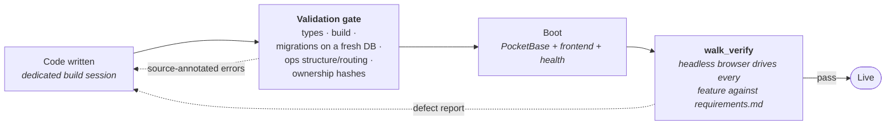

# The Living UI framework

Every Living UI app is built on one stack, from one blueprint: a **React frontend** on a vendored component kit, and a **single PocketBase process** as database, API, and realtime server. One app, one process, one port. This page covers the stack, the ownership contract, how the agent builds and evolves an app (schema, operations, frontend), the bridge that gives apps LLM and integration access without keys, and the pipeline that decides whether an app is allowed to launch.

## The stack

| Layer | What it is |
|---|---|
| Frontend | React + Vite, styled with Tailwind utilities and kit design tokens; components follow shadcn conventions |
| Component kit | A versioned kit vendored into every project (`frontend/src/kit/`): realtime data hooks, entity presets, theme packs, UI primitives, and a console relay that pipes browser errors into the project's logs. System-managed; apps import from its public API and never edit it |
| Backend | PocketBase: collections, REST API, realtime subscriptions, JS migrations, and server hooks (JavaScript) |
| Operations layer | `operations.json` declares the app's public verbs; hook routes implement them; `GET /api/_ops` makes them discoverable |
| A2App adapter | System hooks inside the app that publish its schema, guard every write, and speak the [A2App protocol](a2app-protocol.md). Stamped into the app at create, install, import, and **every launch**, so existing apps pick up adapter fixes |
| CraftBot bridge | A system module hook routes can call to reach the host's LLM and connected integrations, with capability grants and zero keys in the app |

Ports are allocated per app in the `3100-3199` range. An app never depends on CraftBot at runtime: a Living UI needs only the PocketBase binary, and bridge-backed features degrade gracefully when the host is absent.

## Project anatomy

Projects live at `agent_file_system/workspace/living_ui/<name>_<hash>/`:

```text
<name>_<hash>/
├── manifest.json            Identity, ports, authMode, capabilities, run pipeline.
│                            System-managed; the source of truth. Never rename a
│                            project directory by hand.
├── LIVING_UI.md             Per-project plan/index: entities, operations, external
│                            data sources, ownership map. The agent keeps it current.
├── operations.json          Declared verbs (non-system entries are editable)
├── reference/
│   └── requirements.md      The BINDING spec. Verification drives the app against
│                            this file, feature by feature.
├── frontend/
│   └── src/app/             All app UI code                       (editable)
│       src/kit/             The vendored kit                      (system-managed)
│       main.tsx, config.gen.ts, build configs                     (system-managed)
├── pb/
│   ├── pb_hooks/            ops.pb.js + new *.pb.js               (editable)
│   │                        _a2app*.js, _system.pb.js,
│   │                        _craftbot_bridge.js                   (system-managed)
│   └── pb_migrations/       One migration per schema change       (editable)
├── logs/                    pocketbase.log, frontend_console.log, agent-actions.jsonl
├── .agent-token             The A2App write credential (0600, created at launch)
└── .superuser               Machine superuser for administrative API access
                             (0600; never printed, copied, or shipped)
```

**Ownership is a contract, not a convention.** Every file has exactly one owner. The validation gate **hashes the system-managed files and fails the build if the agent touched them**. Need different behavior from a kit component? Wrap it in `app/` code; never edit kit files.

## The requirements spec

`reference/requirements.md` is the binding definition of what the app does. It is written during the creation interview, and **every evolution appends a dated bullet to its `## Changes` section**: verification checks the running app against this file, so a stale spec produces a wrong verdict. If you want to know what an app is supposed to do, this file is the answer.

## How the agent builds

The build loop is fixed, and each step has rules the gate enforces:

```text
1. Read reference/requirements.md and LIVING_UI.md
2. Schema first        → one migration per change in pb/pb_migrations/
3. Operations          → hook route + operations.json entry per public verb
4. Frontend            → compose kit parts in frontend/src/app/
5. Validate            → the gate; fix and repeat until clean
6. Debug               → logs/frontend_console.log and logs/pocketbase.log
```

### Schema

- One JS migration per change; an already-applied migration is never edited.
- Every record carries `id`, `created`, `updated` (autodate fields, following the starter migration's pattern).
- **Collection rules are the security boundary**, set from the project's auth mode in `manifest.json`: open rules for `authMode: none` (single-user), authenticated rules for `authMode: multi-user`. In multi-user apps, owner-scoped data uses a relation to `users` with rules like `owner = @request.auth.id`.

### Operations

Anything an outside agent should be able to *do* to the app is declared in `operations.json` and implemented as a hook route. The gate enforces both directions: every declared `http`/`job` operation must match a registered route, and it warns about routes that were never declared. Operation kinds, parameters, `destructive` marking, and scheduling are part of the protocol contract; see [Operations](a2app-protocol.md#operations).

### External data, and the CraftBot bridge

Apps reach the outside world two ways, both from server hooks only (never frontend `fetch`, where CORS breaks and keys would be public):

- **The CraftBot bridge** for the host's services. Hook routes call `bridge.callLLM(prompt, system)` and `bridge.callIntegration('slack', 'POST', '/chat.postMessage', ...)` through the system module, with **zero API keys in the app**. The bridge fails closed on grants: the integration must be listed under `capabilities.integrations` in the system-managed manifest, and only integrations the user actually connected in CraftBot work. Outside CraftBot the bridge degrades gracefully (`callLLM` returns empty, `callIntegration` returns a 503-shaped status): apps skip the feature rather than crash.
- **Direct `$http.send`** for anything public (weather, stocks, any third-party API), always with a timeout. Base URLs stay as string literals because the gate derives the app's declared `external_hosts` egress capability from them. A non-200 from a source degrades to a clean error and the UI's offline/empty state; generated stand-in data is never substituted for a real source. Periodic syncs use `cronAdd` on the same hook modules.

One constraint shapes all hook code: **handler callbacks run in isolated VMs** that cannot see their own file's scope, so shared logic lives in plain modules and is `require()`d inside each callback.

### Frontend

The frontend is composed from the kit's public API, and the kit does the heavy lifting:

- **Data** is realtime by default: `useCollection('items', { sort: '-created' })` subscribes, so apps never poll and never reload. Writes go through the kit's client wrapper, which surfaces errors as toasts automatically.
- **Entity presets** collapse the common surfaces: `EntityForm` and `EntityTable` take a field/column spec and produce a validated create/edit form (reference fields become live dropdowns) and a live, sortable table with row actions and delete confirmation, both wired to a collection.
- **Primitives and hooks**: typed inputs (number, date, debounced search, tags), overlays (`useConfirm`, drawers, dropdown row actions, tooltips), data display (sparklines, mini bar charts, sortable lists, file/image upload), `useDebounce`, `useHotkey`.
- **Auth**: in multi-user projects the shell wraps the app in a login gate; `useAuth()` exposes the current user.
- **Styling**: Tailwind plus kit tokens (`var(--lui-*)`), never hardcoded colors, because theming is host-owned and must survive style-pack and dark-mode switches.
- **Required UX** (from the global design rules): empty states with a next action, loading states, confirmation dialogs for destructive actions, toasts on CRUD, responsive layout.

## The build pipeline

An app reaches its live URL only through two gates:



- **The validation gate** runs before anything boots: TypeScript must compile, the frontend must build, migrations must apply on a fresh database, the operations manifest must validate and route correctly, and the system-managed files must be untouched. Errors come back source-annotated, and a circuit breaker stops a build that keeps failing on the identical error.
- **walk_verify** is a [sub-agent](../core/concepts/sub-agents.md) that opens the running app in a headless browser and exercises it feature by feature against `reference/requirements.md`, folding server-side errors from `pocketbase.log` into its defect reports. Its verdict is `pass`, `incomplete`, `defects`, `blocked`, or `unparseable`, and a clean pass is the **only** way a change completes. Every change is verified in the dev environment (the new code on a hidden port with a fresh, schema-only database) and a pass **promotes** it: on a first build the live database is created fresh from the migration chain; on an evolution the new migrations apply to the real data at boot (see [Managing apps](managing.md#evolving-an-app)).

The principle behind both gates, and behind the [protocol](a2app-protocol.md) itself: **a property that matters is enforced by the system, not requested of the model.** An app that does not demonstrably work in a real browser is not announced as working.

## Development commands

The agent runs the framework's CLI during builds (production serving is always the host's job, driven by the manifest's install/build/start/health pipeline):

```text
lui validate <project>   the gate; run after every meaningful change
lui dev <project>        PocketBase + Vite HMR for development
lui kit-sync <project>   re-vendor the kit (only when instructed)
lui pb path              the pinned PocketBase binary
```

## Logs

First stop when an app misbehaves:

| File | Contains |
|---|---|
| `<project>/logs/pocketbase.log` | Server side: hooks, migrations, API errors, bridge calls |
| `<project>/logs/frontend_console.log` | The browser console (`console.error`/`warn` and uncaught errors), relayed automatically by the kit |
| `<project>/logs/agent-actions.jsonl` | Every agent write, attributed to the agent id that made it |

## Next

- [The A2App protocol](a2app-protocol.md): the contract this stack serves to agents
- [Managing apps](managing.md): operating and evolving a delivered app
- [Sub-agents](../core/concepts/sub-agents.md): how walk_verify runs
