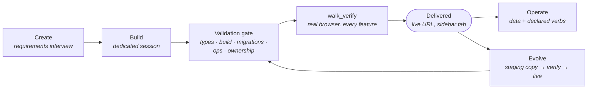

# Living UI

Living UI is CraftBot's application platform. Describe an app in chat and the agent designs, codes, verifies, and launches a real web application (database, API, realtime web UI) that runs locally and renders inside the CraftBot browser interface. The app is not a demo artifact: after delivery the agent **operates** it on your behalf, **evolves** it when you ask for changes, and any other agent or script can drive it through an open protocol.

Two pieces make that trustworthy:

- :material-cube-outline:{ .lg .middle } __[The Living UI framework](framework.md)__

    ---

    What a generated app is made of and how the agent builds and evolves it: a React frontend on a vendored component kit, a single PocketBase backend, a declared operation surface, an LLM/integration bridge, and a build pipeline that refuses to launch anything it has not verified in a real browser.

- :material-swap-horizontal:{ .lg .middle } __[The A2App protocol](a2app-protocol.md)__

    ---

    The contract every Living UI presents to *any* agent: the app describes its own data model and verbs, guards every write it cannot store correctly, and the system (not the model) reports what changed. Covers the transports available today and the ones on the roadmap.

- :material-play-circle-outline:{ .lg .middle } __[Managing apps](managing.md)__

    ---

    Operating a delivered app's data and verbs, evolving it safely through a staging copy, restarting, importing, converting foreign apps, and the marketplace.

## Build, evolve, operate

The agent's relationship with a Living UI has three distinct capabilities, and the platform enforces the boundaries between them:

| Capability | What it means | What guarantees it |
|---|---|---|
| **Build** | Turn a requirements interview into a working app: schema, verbs, UI | The validation gate plus browser verification; an app that does not demonstrably work is never announced as working |
| **Evolve** | Change a delivered app's code and schema on request | A staging copy with cloned data; the live app is replaced only by a verified successor |
| **Operate** | Act on the app's data and declared verbs in seconds ("add a todo for tomorrow" becomes a row) | The A2App protocol: schema discovery, write guards, and system-authored receipts |

The distinction between operating and evolving is decided per request by the agent, and it matters: a data write never triggers a rebuild, and a code change never touches live data until it verifies. See [Managing apps](managing.md).

## Creating an app

Two entry points, one pipeline:

- **Chat.** Ask for the app you want: "build me a kanban board for my freelance projects". The agent runs a requirements interview; if questions remain open, a form pops up in the browser to collect the answers.
- **Add Living UI** in the browser sidebar opens the creation wizard directly: name, description, layout, theme, and reference files.

The build then runs in the project's own dedicated session, so your chat stays free. You watch progress live in the project's sidebar tab, and the app is announced ready only after it has passed the [build pipeline](framework.md#the-build-pipeline): validation gate, boot, and feature-by-feature browser verification against the requirements spec.

## What a running app offers

Every running Living UI is one local process on its own port that presents the same surface to every client:

- **A web UI** for you, rendered in the app's sidebar tab (and reachable directly in any browser), updating in realtime as data changes.
- **The A2App protocol** for agents: self-describing schema (`GET /api/_a2app/describe`), a discoverable verb surface (`GET /api/_ops`), guarded record CRUD, and machine-readable errors.
- **Declared operations**: the verbs the app's author decided outsiders may invoke, including long-running jobs and scheduled work.
- **An audit trail**: every agent write is attributed and logged per project.

CraftBot drives this surface primarily through its `lui` CLI, falling back to raw HTTP when the CLI cannot express a call; external agents drive the identical surface with plain HTTP. Transports, including why the CLI is preferred over an MCP gateway and the planned app-to-agent direction, are covered in [the protocol page](a2app-protocol.md#transports).

## Design preferences

`agent_file_system/GLOBAL_LIVING_UI.md` holds your universal design rules (colors, theme behavior, always-enforced component and UX rules) and is applied to every project the agent builds. Per-project decisions and agreed overrides live in each project's own `LIVING_UI.md`. Theming itself is host-owned: apps use kit tokens rather than hardcoded colors, so style packs and dark mode keep working across every app, and each project tab has a theme picker.

## Where apps live

- **In the browser:** one sidebar tab per project, with creation progress, clarifying-question forms, and the theme picker.
- **On disk:** `agent_file_system/workspace/living_ui/<name>_<hash>/`; see [project anatomy](framework.md#project-anatomy).
- **At runtime:** one process per app on a port in the `3100-3199` range. An app depends only on the PocketBase binary, not on CraftBot: it keeps working, protocol included, wherever it runs.

## Next

- [The Living UI framework](framework.md): the stack, the build loop, and the verification gates
- [The A2App protocol](a2app-protocol.md): the full agent-facing contract, transport options, and the roadmap
- [Managing apps](managing.md): operate, evolve, restart, import
