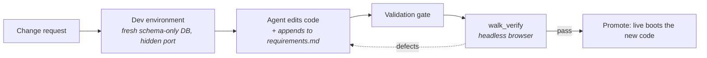

# Managing apps

A delivered Living UI is a live application with your real data in it. Everything that happens to it afterward falls into two categories with very different mechanics: **operating** (data and verb calls through the [A2App protocol](a2app-protocol.md): instant, no rebuild) and **evolving** (code and schema changes, which go through a dev environment and full re-verification before they touch the live app). This page covers both, plus restarting, importing, converting foreign apps, the marketplace, and multi-agent use.

## Operate or evolve

The agent decides which category a request is, per request; nothing is routed in advance:

| You say | Category | What happens |
|---|---|---|
| "add a todo for tomorrow" | Operate | One validated write. Seconds |
| "clear all the done items" | Operate | One declared operation, confirmed first if marked destructive |
| "summarise this week's entries" | Operate | Reads plus (if the app declares one) an operation |
| "add a priority filter to the board" | Evolve | Dev environment, code, validation gate, browser verification, then promote |

The boundary is enforced, not just encouraged. Getting it wrong used to be expensive: a data write that triggers the build machinery rebuilds a live app and drives a browser over your real records. Build skills therefore load **per run**, chosen by the agent from the request, and a plain write never touches them.

## Operating an app

Ask in chat; the app's sidebar tab or the main chat both work. Under the hood the agent follows the discovery ladder every A2App client follows:

```text
1. Identity     GET /api/_a2app          confirm it is the right app, cache-check the schema
2. Verbs        GET /api/_ops            what can this app DO?
3. Declared op exists → run it           destructive ops are confirmed with you first
4. No op → record CRUD                   read freely; write only what the app's own UI offers
5. Would require new code → that is an evolution, not an operation; the agent says so
```

The agent walks this ladder through the **`lui` CLI**, its primary transport: the CLI resolves the port, authenticates, and validates parameters against the live schema. Raw HTTP is the fallback for calls the CLI cannot express; see [Transports](a2app-protocol.md#transports) for the hierarchy and why the CLI is preferred over an MCP gateway.

Three properties make this safe to do casually:

- **The write is guarded.** Bad values are refused with machine-readable errors; nothing lands half-stored. See [the write path](a2app-protocol.md#the-write-path).
- **The confirmation is a receipt.** The line you read is generated from the stored record, not from the model's belief about what it did.
- **The UI updates in place.** Apps subscribe to their data in realtime, so a write appears on screen without a reload.

Long-running work runs as a **job**: the operation returns a `jobId` immediately and the agent polls its status rather than blocking. Operations can also declare a **schedule** (`"every 15m"`, `"daily 09:00"`), for work the app wants run recurrently.

Because the surface is the open protocol, you are not limited to CraftBot: any agent or script holding the app's token can operate the same data the same way, and every write is attributed in `logs/agent-actions.jsonl` so shared use stays untangled.

## Evolving an app

Code changes to a delivered app never touch it directly:



- The agent loads a build skill for the run, works in a **dev environment** — a disposable copy of the app's code on a hidden port whose database is rebuilt fresh from the migration chain (your real data is never cloned into it) — and follows the same [build loop](framework.md#how-the-agent-builds) as a first build: schema migrations first, operation declarations, kit-composed UI, gate after every meaningful change.
- The change is appended to `reference/requirements.md` under `## Changes`, keeping the binding spec current; verification checks the app against that file, so a stale spec would produce a wrong verdict.
- Only a clean verification verdict promotes the change to live. A failed change never replaces the working app, and your real data is never the test bed — it never even enters the environment being tested.

Mid-arc writes to the live app's real data are refused while an evolution is in flight, so the two paths cannot interleave.

## Backups

Every native app's live data (database + uploaded files) is backed up automatically — **daily, keeping the last 7**, by default. Configure it per app in **Settings → Living UI**: switch scheduled backups off, pick a frequency (hourly / 6 h / daily / weekly), set how many to keep, or take a manual backup with **Back up now**. Three kinds of archives accumulate:

- **Scheduled** — taken on the interval you chose; the oldest beyond your keep-count are pruned automatically.
- **Pre-update** — taken automatically right before every code change is deployed to an app with live data (the last 3 are kept). If this backup fails, the deploy is aborted rather than risked.
- **Manual** — taken with the button; never removed automatically.

Archives live outside the app's own directory (`living_ui/_backups/`), so they survive anything that happens to the app — including deleting it: a deleted app's backups are kept and listed under **Leftover backups** in the same settings tab until you remove them yourself. Backups never leave your machine and are not part of project exports.

**Restoring** (from the app's backup list in settings) returns the app to the archived state: data created after that point is removed, but the current state is backed up first — so a restore can itself be undone. Restore is a user action only; the agent cannot trigger it.

## Restarting

Ask the agent to restart an app (or use its tab). A restart runs the full launch pipeline: dependency check, validation gate, boot (PocketBase plus frontend), health check. Launch also re-stamps the [A2App adapter](a2app-protocol.md) and refreshes the agent token, which is how apps a user already had pick up adapter fixes; delivery at create, install, import, **and every launch** is what keeps the whole installed base current.

## Importing, converting, and the marketplace

| Source | What happens |
|---|---|
| **Marketplace** | Pre-built apps installed by id from the app's tab or chat. As-is installs skip browser verification; asking for adaptations turns the install into a build |
| **A Living UI project** (ZIP, folder, git URL) | Registered as a new delivered project: credentials stripped, kit re-vendored, adapter stamped, launch verification queued in its own session |
| **Any other app** (foreign stack) | Registered as an **external app**: it runs under CraftBot with a `craftbot.json` run config (install/build/start/health verbs), logs to `logs/app.log`, but does not speak the protocol. Ask the agent to **convert** it and it rebuilds the app on the Living UI framework: the original source is kept in `reference/source/`, requirements are synthesized from it, then the normal build pipeline runs |

## Multi-agent use

An app is a surface several agents can share deliberately:

- **Give an agent access** by handing it the project's `.agent-token` (and, on a multi-user app, an account to act as). Handing out the token is the act that grants write access; nothing is ambient.
- **Tell writers apart** via `X-LUI-Agent` attribution in `logs/agent-actions.jsonl`. It defends against confusion, not malice; on one machine, everything running as you is already inside the trust boundary.
- The planned per-agent identity model (keypairs, scoped grants, per-call consent for destructive operations) extends this to deployed apps; see [Beyond one machine](a2app-protocol.md#beyond-one-machine).

## Troubleshooting

| Symptom | Check |
|---|---|
| App tab is blank or erroring | `<project>/logs/frontend_console.log`; the browser console is captured there automatically |
| Writes fail or data looks wrong | `<project>/logs/pocketbase.log` for server-side causes; a protocol rejection names the field and rule in its [error code](a2app-protocol.md#errors) |
| Not sure the thing on a port is your app | `GET /api/_a2app`; check `a2app: true` and `app.id`, never the status code |
| An operation seems missing | `GET /api/_ops` is the authoritative verb list; if the verb is not there, the app does not offer it and adding it is an evolution |
| A build or evolution keeps failing | Gate errors are source-annotated, and a circuit breaker stops identical-error loops; the build session's activity shows the last gate output |
| A bridge-backed feature does nothing | The integration must be connected in CraftBot and granted in the app's manifest capabilities; outside CraftBot, bridge features degrade to skipped |
| Which agent changed my data? | `<project>/logs/agent-actions.jsonl` records every write with the agent id that made it |

Do not rename or move a project directory by hand: `manifest.json` is the source of truth for identity and ports, and the platform manages the directory. And never print or copy `.superuser`; it is the machine-level administrative credential.

## Next

- [The A2App protocol](a2app-protocol.md): the contract behind every operate request
- [The Living UI framework](framework.md): the build loop and pipeline behind every evolution
